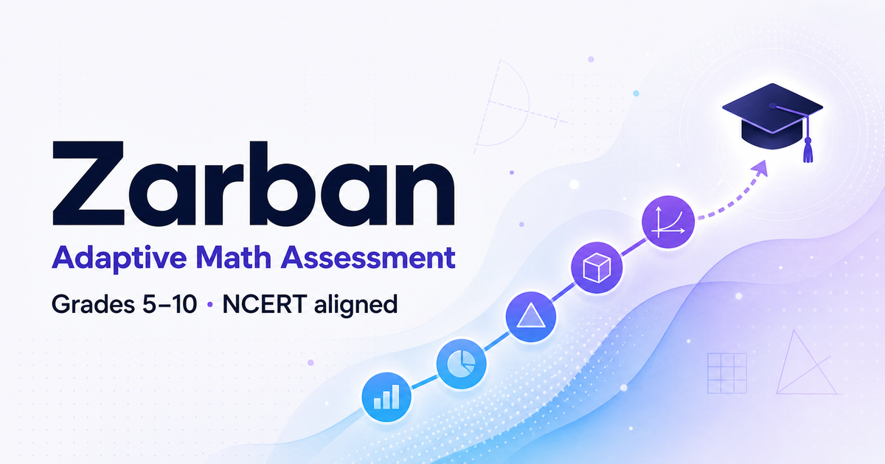
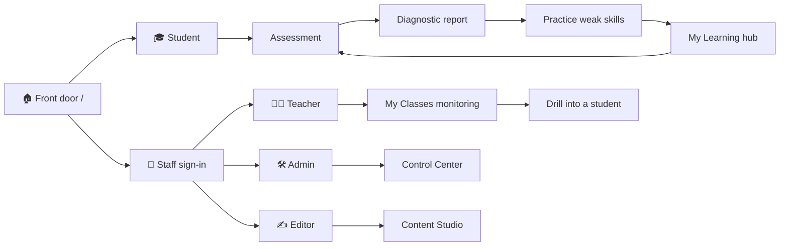
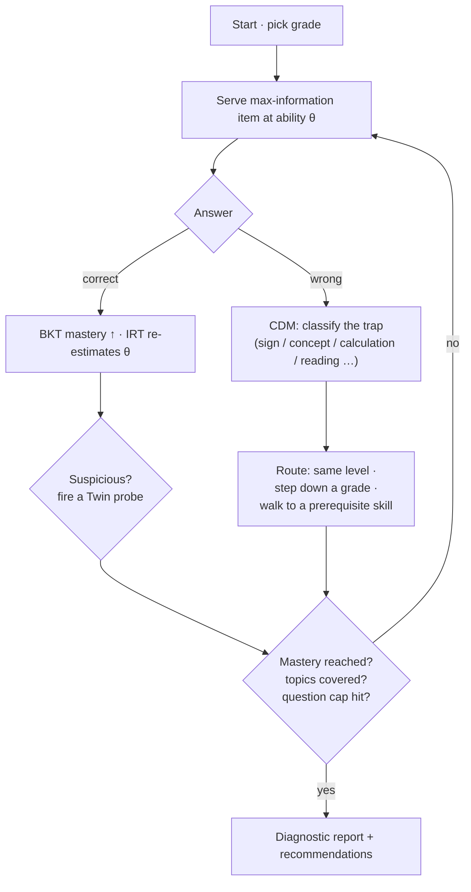
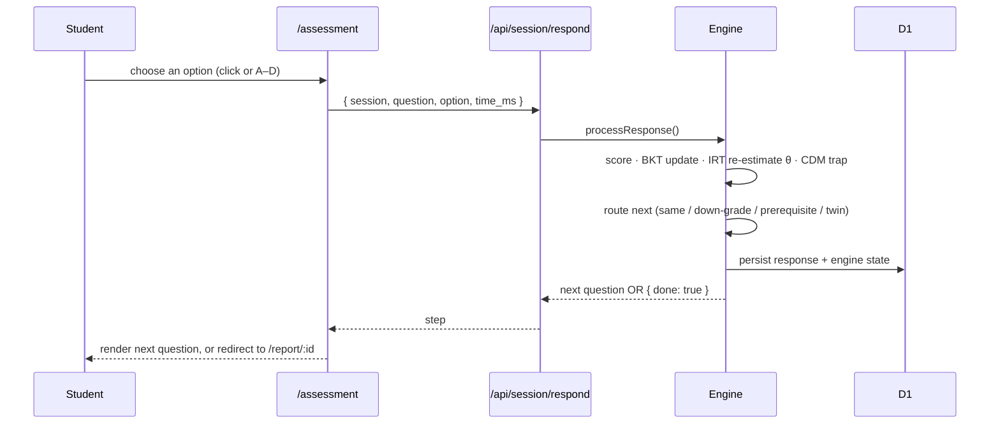
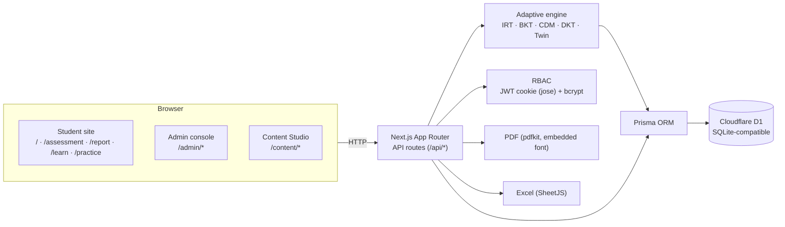
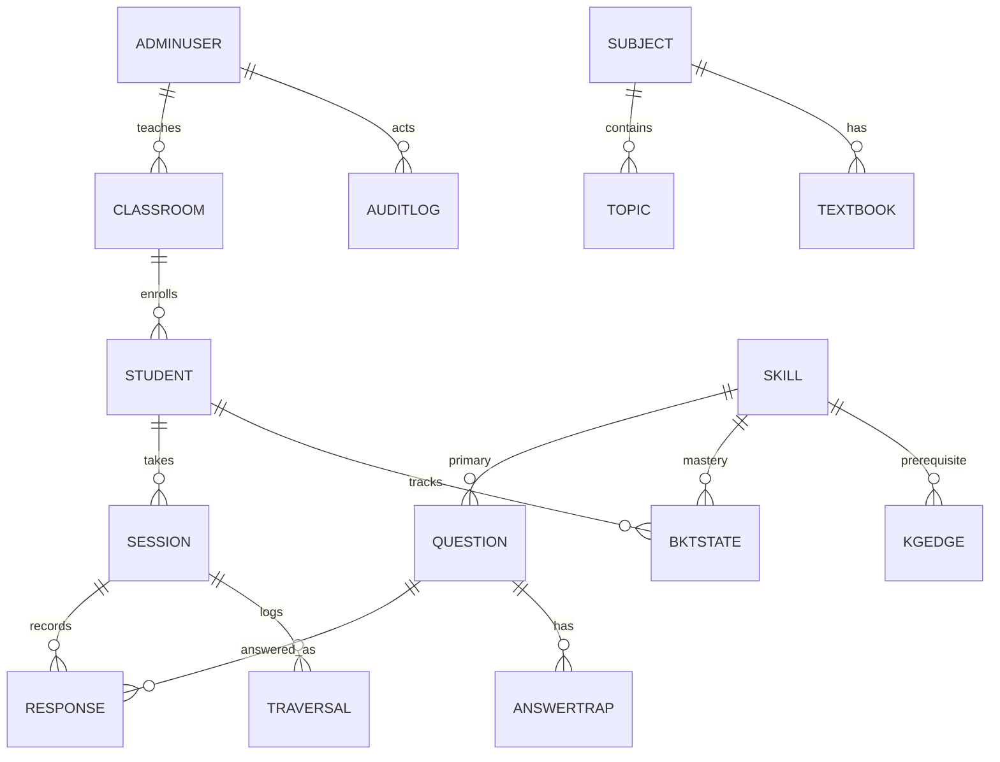
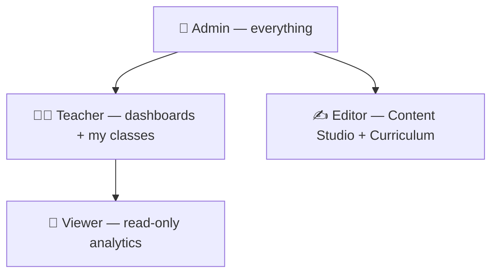
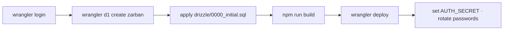

<div align="center">



# Zarban

### A full-fledged adaptive assessment & learning ecosystem for Grades 5–10 (NCERT-aligned)

Zarban runs a genuine multi-algorithm diagnostic — **CAT + IRT**, **CDM**, **BKT**,
**DKT-lite** and a **Twin-Question probe** — to discover not just *what* a student
got wrong but *why*, then closes the loop with targeted practice, a personal
learning hub for students, a monitoring console for teachers, and a full control
plane for administrators.

<br/>


[](https://zarban.zarbanlabs-app.workers.dev)

<br/>

### 🚀 Live app — [**zarban.zarbanlabs-app.workers.dev**](https://zarban.zarbanlabs-app.workers.dev)

Hosted **free** on Cloudflare Workers + D1 &nbsp;·&nbsp; [Home](https://zarban.zarbanlabs-app.workers.dev) · [Assessment](https://zarban.zarbanlabs-app.workers.dev/assessment) · [Learn](https://zarban.zarbanlabs-app.workers.dev/learn) · [Syllabus](https://zarban.zarbanlabs-app.workers.dev/content/syllabus) · [Admin](https://zarban.zarbanlabs-app.workers.dev/admin/login)

</div>

---

## Table of contents

- [Live demo](#live-demo)
- [What is Zarban](#what-is-zarban)
- [The three experiences](#the-three-experiences)
- [Feature matrix](#feature-matrix)
- [The adaptive engine](#the-adaptive-engine)
- [How an assessment flows](#how-an-assessment-flows)
- [Architecture](#architecture)
- [Data model](#data-model)
- [Roles & access (RBAC)](#roles--access-rbac)
- [Route & API reference](#route--api-reference)
- [Curriculum, Syllabus & the question bank](#curriculum-syllabus--the-question-bank)
- [Quick start](#quick-start)
- [Testing](#testing)
- [Project structure](#project-structure)
- [Deployment](#deployment)
- [Configuration & security](#configuration--security)

---

## Live demo

Zarban is deployed **live and free** on Cloudflare Workers + D1:

> ### 🌐 https://zarban.zarbanlabs-app.workers.dev

**Main app (public)**

| Link | What it is |
|---|---|
| [`/`](https://zarban.zarbanlabs-app.workers.dev) | Home |
| [`/assessment`](https://zarban.zarbanlabs-app.workers.dev/assessment) | Take the adaptive assessment |
| [`/learn`](https://zarban.zarbanlabs-app.workers.dev/learn) | Student learning hub |
| [`/practice`](https://zarban.zarbanlabs-app.workers.dev/practice) | Practice mode (by skill) |

**Content Studio**

| Link | What it is |
|---|---|
| [`/content`](https://zarban.zarbanlabs-app.workers.dev/content) | Studio hub |
| [`/content/syllabus`](https://zarban.zarbanlabs-app.workers.dev/content/syllabus) | Syllabus (NCERT, by grade) |
| [`/content/curriculum`](https://zarban.zarbanlabs-app.workers.dev/content/curriculum) | Curriculum + textbooks |
| [`/content/skills`](https://zarban.zarbanlabs-app.workers.dev/content/skills) | Interactive skills knowledge graph |

**Admin console** — sign in at [`/admin/login`](https://zarban.zarbanlabs-app.workers.dev/admin/login)

| Link | What it is |
|---|---|
| [`/admin`](https://zarban.zarbanlabs-app.workers.dev/admin) | Dashboard (command center) |
| [`/admin/analytics`](https://zarban.zarbanlabs-app.workers.dev/admin/analytics) | Analytics |
| [`/admin/students`](https://zarban.zarbanlabs-app.workers.dev/admin/students) | Students |
| [`/admin/classrooms`](https://zarban.zarbanlabs-app.workers.dev/admin/classrooms) | Classrooms |
| [`/admin/questions`](https://zarban.zarbanlabs-app.workers.dev/admin/questions) | Question bank |
| [`/admin/syllabus`](https://zarban.zarbanlabs-app.workers.dev/admin/syllabus) | Syllabus editor |
| [`/admin/users`](https://zarban.zarbanlabs-app.workers.dev/admin/users) | User access (RBAC) |
| [`/admin/system`](https://zarban.zarbanlabs-app.workers.dev/admin/system) | System & audit |

> **Demo sign-in:** `admin@zarban.local` / `admin123` — please change this in **User Access** on your own deployment.

---

## What is Zarban

Most "assessment tools" tell you a **score**. Zarban tells you the **cause** and
gives you the **next step**.

- It serves questions **adaptively** — the next item is chosen by maximum
  information at the student's current estimated ability (θ), so a strong student
  is quickly stretched and a struggling one is met where they are.
- Every wrong option is pre-mapped to a **specific misconception** (a "trap"),
  so the report explains mistakes instead of just counting them.
- When a correct answer looks suspicious, a **Twin-Question** probe checks whether
  it was mastery or a lucky guess.
- Results become **action**: the report's focus areas and the learner hub's
  recommendations link straight into **Practice Mode**, where the same
  misconception explanations teach on every wrong answer.

It is a single deployable app (Next.js App Router on Cloudflare Workers + D1) —
one process, no external ML service, all engine math is closed-form TypeScript.

**At a glance:** 911 questions · 2,733 misconception traps · 33 skills · a
knowledge graph · 4 subjects / 239 topics / 37 textbooks of NCERT curriculum ·
39 unit tests · a 136-check end-to-end suite.

---

## The three experiences



### 🎓 Student — assess → understand → practise → track
| Screen | Route | What it does |
|---|---|---|
| Landing | `/` | Enter name + grade, resume an in-progress test, or head to Practice / My progress. |
| Assessment | `/assessment` | One question at a time, a running clock, keyboard **A–D** answering, no marks shown — the test adapts silently. |
| Diagnostic report | `/report/:id` | Grade-equivalent, five learning dimensions (radar), skill-mastery bars, error-pattern breakdown, **fluke / rushed** behaviour flags, foundational-gap chains, per-question analysis, and **focus areas that link into Practice**. PDF export. |
| Detailed analysis | `/report/:id/analysis` | The ability (θ) journey, the adaptive path the engine took, time-per-question, skill/topic deep-dives, mistakes & misconceptions. |
| Practice Mode | `/practice` | Pick a skill and drill it: instant right/wrong feedback and, on a miss, the exact misconception behind the option you chose. Keyboard 1–4 / A–D + Enter. |
| My Learning | `/learn` | Score trend across assessments, current skill mastery, what to practise next, and links to every past report. |

### 🧑‍🏫 Teacher — monitor the class, spot who needs help
- **My Classes** (`/admin/classrooms?mine=1`) — the classrooms they own, each with a "N to review" badge.
- Per-student **attention flags**: not assessed, scored under 50%, or a mastery gap.
- Drill into any student (`/admin/students/:id`), replay any session, view cohort analytics.

### 🛠️ Admin — full control
- **Control Center**: User Access (create staff, roles, password reset — with guardrails), System & Audit (danger-zone data resets behind a typed phrase; append-only audit log), Settings (max questions, time limit).
- Classrooms, Curriculum & Syllabus, the Question Bank, and the Content Studio.

### ✍️ Editor — author the content
- **Content Studio**: overview/health, the **Syllabus** (NCERT textbooks by grade), **Curriculum** (subjects → chapters), **Skills & Graph** (a visual, interactive knowledge tree), **Questions** (author MCQs with options, Q-matrix skills, dimensions and per-option traps), and Excel **Import / Export**.

---

## Feature matrix

| Area | Capabilities |
|---|---|
| **Adaptive engine** | 3PL IRT · Newton–Raphson θ MLE · max-information item selection · exact BKT · CDM answer-traps · DKT-lite prerequisite routing · Twin-Question probe |
| **Diagnosis** | 5 learning dimensions · error taxonomy · reading-vs-math gap · foundational-gap chains · lucky-guess & rushed-answer detection · grade equivalence |
| **Learning loop** | Practice Mode with instant feedback + misconception explanations · report/hub recommendations that deep-link into practice |
| **Teacher tools** | Owned classrooms · attention flags · student drill-down · session replay · cohort analytics |
| **Admin control** | RBAC (Admin/Teacher/Viewer/Editor) · user management · audit log · data-maintenance danger zone · settings |
| **Content** | 911-question bank · knowledge-graph editor · curriculum & syllabus editors · NCERT textbooks with soft-copy links · Excel round-trip |
| **Output** | On-screen report · PDF export (embedded font, Workers-safe) · Excel export |
| **Polish** | Accessible focus rings · page transitions · staggered reveals · shaped skeleton loaders · keyboard-first flows · reduced-motion support |

---

## The adaptive engine

Every response updates the student model **before** the next item is chosen.
Five techniques cooperate in one closed-form TypeScript engine (`src/lib/engine/`).



| Technique | File | Detail |
|---|---|---|
| **CAT + IRT (3PL)** | `irt.ts` | `P(θ)=c+(1−c)/(1+e^(−a(θ−b)))`; Newton–Raphson MLE re-estimates ability θ ∈ [−4, 4] over the whole session; the next item maximises Fisher information at the current θ. Item parameters (a, b, c) are derived from grade + difficulty band on import. |
| **BKT** | `bkt.ts` | Exact Bayesian mastery update per skill — P(L₀)=0.10, P(T)=0.3, P(G)=0.2, P(S)=0.1; mastery ≥ 0.95, foundational gap ≤ 0.30. |
| **CDM** | Q-matrix + answer traps | Each wrong option maps to a misconception (`Concept_Error`, `Sign_Error`, `Calculation_Error`, `Reading_Error`, `Procedural_Error`, `Careless_Slip`) and a remedial route. |
| **DKT-lite** | `orchestrator.ts` | Sequence-aware routing that walks the prerequisite knowledge graph downward when foundational gaps appear. |
| **Twin Question** | orchestrator | A parallel equation-only probe confirms whether a correct word-problem answer was mastery or a lucky guess — powering the reading-vs-math diagnosis. |

> **One deliberate spec fix:** BKT/IRT updates run on **every** response *before*
> routing (the spec prose requires this; its pseudocode returned early on wrong
> answers).

---

## How an assessment flows



---

## Architecture



| Layer | Choice |
|---|---|
| Frontend + API | Next.js 16 (App Router) · TypeScript 5.9 · Tailwind CSS 4 · Recharts · lucide-react |
| Runtime / deploy | **Cloudflare Workers** via `vinext` + `wrangler` |
| Engine | Pure TypeScript (`src/lib/engine/`) — closed-form, single process |
| Database | **Prisma** ORM → **Cloudflare D1** (SQLite-compatible; schema is Postgres-portable) |
| Auth | bcrypt (`bcryptjs`) + signed JWT cookie (`jose`); roles Admin · Teacher · Viewer · Editor |
| Docs/PDF | `pdfkit` with an embedded Noto Sans subset (no filesystem font — Workers-safe) |
| Content pipeline | SheetJS (`xlsx`) — the same parser powers import, export and the seed |

---

## Data model



Core tables (`prisma/schema.prisma`): `skills`, `questions`, `q_matrix`,
`answer_traps`, `question_dimensions`, `knowledge_graph`, `students`, `sessions`,
`responses`, `bkt_state`, `dimension_scores`, `traversal_events`, `review_flags`,
`settings`, `admin_users`, `admin_audit_log`, `classrooms`, `subjects`, `topics`,
`textbooks`.

---

## Roles & access (RBAC)



- **Admin** — analytics, classrooms, **User Access**, **System & Audit**, settings, Content Studio, Syllabus/Curriculum.
- **Teacher** — dashboards, students, cohort analytics, and a **My Classes** monitoring view for classrooms they own.
- **Viewer** — read-only analytics and syllabus.
- **Editor** — Content Studio + Curriculum authoring (no analytics).

Enforcement: every admin API is gated by `requireRole(min)` (Admin > Teacher >
Viewer); content APIs by `requireContentRole()` (Admin or Editor). Auth is a
signed HttpOnly JWT cookie; the Content Studio shares the same session, so an
Admin moves between console and studio without re-signing-in.

---

## Route & API reference

**Student pages** — `/` · `/assessment` · `/report/[id]` · `/report/[id]/analysis` · `/learn` · `/practice`

**Admin pages** — `/admin` · `/admin/students[/id]` · `/admin/classrooms[/id]` · `/admin/analytics` · `/admin/questions` · `/admin/syllabus` · `/admin/users` · `/admin/system` · `/admin/settings` · `/admin/sessions/[id]`

**Content Studio** — `/content` · `/content/syllabus` · `/content/curriculum` · `/content/skills` · `/content/questions` · `/content/import`

**Key APIs**

| Group | Endpoints |
|---|---|
| Session | `POST /api/session/start` · `POST /api/session/respond` · `POST /api/session/finish` · `GET /api/session/report/[id]` · `GET /api/session/report/[id]/pdf` |
| Learn / Practice | `GET /api/learn/[studentId]` · `GET /api/practice` (catalog) · `GET /api/practice?skill=…` |
| Admin | `…/auth/login·logout·me` · `stats` · `students[/id]` · `sessions/[id]/replay` · `analytics` · `questions[/id]` · `settings` · `users[/id]` · `maintenance` · `audit` · `classrooms[/id][/students…]` · `syllabus` |
| Content | `me` · `overview` · `skills[/id]` · `questions[/id]` · `import` · `export` · `curriculum[…]` · `curriculum/textbooks[/id]` · `syllabus` |

---

## Curriculum, Syllabus & the question bank

- **Curriculum catalog** (separate from the assessable bank): 4 subjects ·
  239 topics/chapters · Grades 6–10 (Mathematics, Science, Social Science, English).
- **Syllabus** — NCERT **textbooks laid out grade-by-grade**, each with a soft-copy
  link to the official free NCERT source, plus a subject overview and each grade's
  "N assessable skills · M practice questions" with a **Practise** jump-off.
- **Question bank** — **911** parametrically generated, NCERT-aligned MCQs across
  Grades 5–10 with full-signature de-duplication; **2,733** misconception traps
  (every wrong option diagnosed); 149 word-problem / equation-twin pairs; a QA gate
  (`npm run verify:workbook`) enforcing integrity, trap coverage, and ≥3 items per
  `{skill, band}` cell.

> The seeded chapter/textbook lists follow the well-known NCERT editions and are
> fully editable — verify against the exact (2023–24 rationalised) edition in use.

---

## Quick start

```bash
npm install
npm run setup          # db push + generate the SME workbook + verify + seed

# Fast production server (recommended):
npm run build && npm start        # http://localhost:3000

# Or hot-reload dev:
npm run dev
```

**Sign in:**

| Surface | URL | Credentials |
|---|---|---|
| Student | `/` → name + grade | — |
| Admin console | `/admin` | `admin@zarban.local` / `admin123` |
| Teacher | `/admin` | `teacher@zarban.local` / `teacher123` |
| Viewer | `/admin` | `viewer@zarban.local` / `viewer123` |
| Content Studio | `/content` | `editor@zarban.local` / `editor123` |

> ⚠️ These are seeded dev credentials — set a real `AUTH_SECRET` and rotate every
> password (**User Access**) before going live.

---

## Testing

```bash
npm test           # 39 engine unit tests (BKT / IRT / CAT / difficulty / health)
npm run typecheck  # strict TypeScript
npm run e2e        # 136-check end-to-end suite (needs the dev server running)
npm run build      # production build
npm run verify:workbook   # QA gate on the question bank
```

The **end-to-end suite** drives the running server through its real HTTP API and
asserts the whole platform: student lifecycle (all-correct & all-wrong), the
report + detailed analysis + PDF, fluke/rushed detection, the learning hub,
**Practice Mode**, admin auth & RBAC, classrooms + teacher monitoring, the
curriculum/syllabus, content-portal CRUD, and cross-role denial.

---

## Project structure

```
src/
  app/
    (student)   / · /assessment · /report/[id]/(analysis) · /learn · /practice
    admin/      dashboard · students · classrooms · analytics · questions ·
                syllabus · users · system · settings · sessions/[id] · template.tsx
    content/    overview · syllabus · curriculum · skills(+graph) · questions ·
                import · template.tsx
    api/        session/* · learn/* · practice · admin/* · content/*
    layout.tsx  globals.css  icon.svg  not-found.tsx  error.tsx
  lib/
    engine/     irt · bkt · orchestrator · fetch-question · report ·
                grade-equivalent · topics · types
    curriculum/ ncert (data) · syllabus (builder) · subject-blurb
    content/    health · question-validate · skill-helpers
    auth.ts  db.ts  audit.ts  use-escape.ts
  generated/prisma/   (generated client)
prisma/schema.prisma   drizzle/0000_initial.sql
scripts/   generate-workbook · verify-workbook · seed-devdb · seed-curriculum ·
           export-d1-migration.py · e2e.ts   tests/   data/   docs/
```

---

## Deployment

Zarban is Cloudflare-native (Workers + D1) and hosts **free** on Cloudflare's
free plan. Full copy-paste guide in **[DEPLOY.md](DEPLOY.md)**:



A fresh D1 comes up fully seeded (911 questions, curriculum, staff accounts) so
sign-in works immediately after the first deploy.

---

## Configuration & security

- **`AUTH_SECRET`** — signs the admin JWT. A stable dev fallback exists so it
  works out of the box; **set a real secret in production**.
- **`DATABASE_URL`** — SQLite locally (`file:./dev.db`); D1 binding `DB` in
  production.
- Passwords are bcrypt-hashed; sessions are HttpOnly, SameSite=Lax, `secure` in
  production. Destructive admin actions require a typed confirmation phrase and
  are written to an append-only audit log. Reads are role-gated; writes are
  gated more tightly (Admin, or Editor for content).
- Change the seeded staff passwords immediately after the first sign-in.

---

<div align="center">
<sub>Built with the Claude Agent SDK · Grades 5–10 · NCERT-aligned · one deployable app</sub>
</div>
