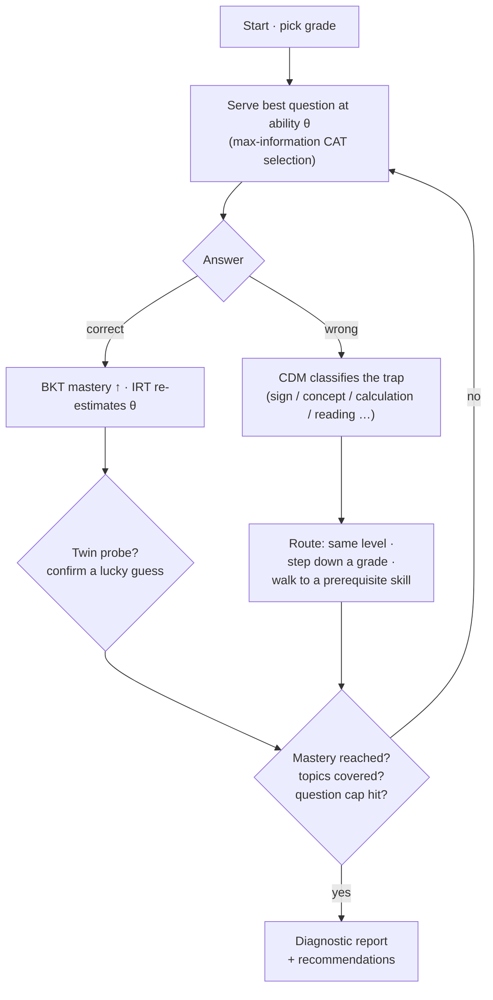
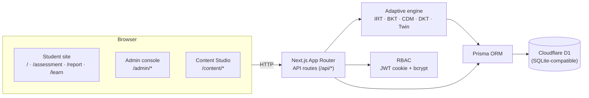
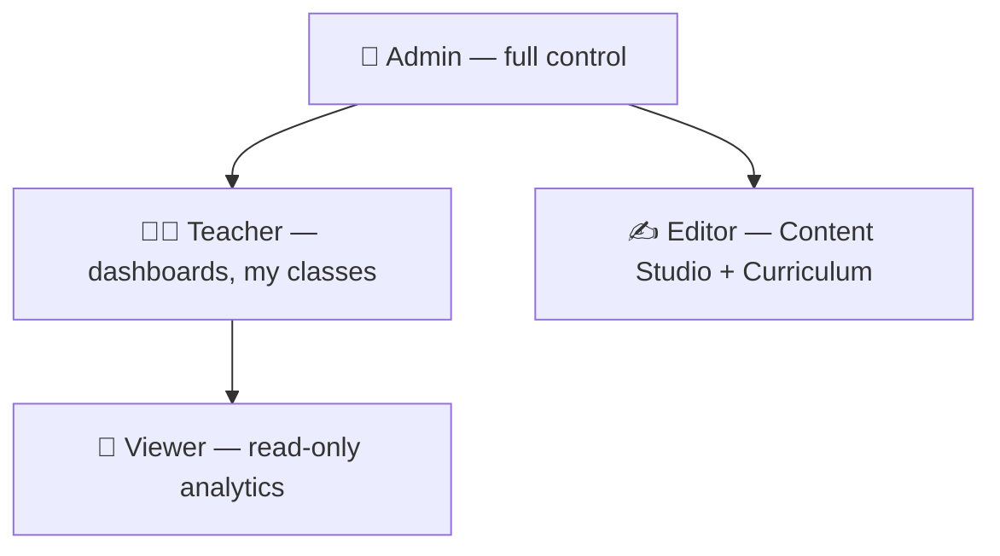
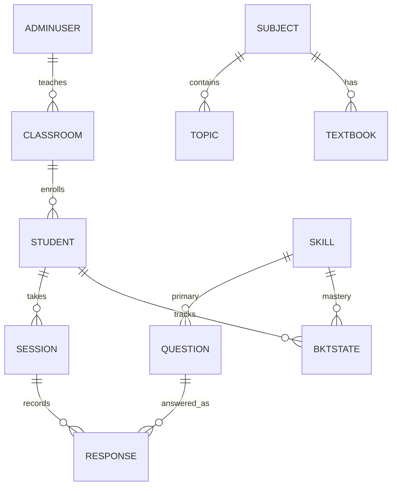

<div align="center">


# Zarban

### An adaptive math assessment & learning platform for Grades 5–10, NCERT-aligned

Zarban runs a genuine multi-algorithm diagnostic — **CAT + IRT**, **CDM**, **BKT**,
**DKT-lite** and a **Twin-Question probe** — to find not just *what* a student got
wrong, but *why*, and turns it into a learning loop for students, a monitoring
console for teachers, and full control for admins.

<br/>


</div>

---

## ✨ Highlights

Zarban is an end-to-end LMS built around one adaptive engine, serving three roles:

| 🎓 Students | 🧑‍🏫 Teachers | 🛠️ Admins |
|---|---|---|
| Adaptive assessment that adjusts to every answer | **My Classes** monitoring dashboard | **Control Center**: users, roles, audit log |
| A diagnostic **report** — mastery, 5 learning dimensions, root-cause | Flags students needing attention (low score, skill gaps, rushing) | Danger-zone data maintenance (typed-confirm) |
| **My Learning** hub — score trend, mastery, what to practise next | Own classrooms; per-student attention reasons | **Curriculum** + **Syllabus** editors, NCERT textbooks by grade |
| PDF report export | Drill into any student, replay any session | **Content Studio**: questions, skills, Q-matrix, traps |

**Extras that make it feel real:** lucky-guess (fluke) & rushed-answer detection,
foundational-gap chains, reading-vs-math gap diagnosis, session replay, cohort
analytics, Excel import/export of the whole question bank, and a full RBAC model.

---

## 🧠 The adaptive engine

Every response updates the student model *before* the next question is chosen.
Five techniques cooperate in one closed-form TypeScript engine — no external ML
service required.



| Technique | File | What it does |
|---|---|---|
| **CAT + IRT (3PL)** | `src/lib/engine/irt.ts` | `P(θ)=c+(1−c)/(1+e^(−a(θ−b)))`; Newton–Raphson MLE re-estimates ability θ∈[−4,4] over session history; questions chosen by maximum information. |
| **BKT** | `src/lib/engine/bkt.ts` | Exact Bayesian mastery update per skill (P(L₀)=.10, P(T)=.3, P(G)=.2, P(S)=.1); mastery ≥ .95, foundational gap ≤ .30. |
| **CDM** | Q-matrix + answer traps | Each wrong option maps to a specific misconception and a remedial route. |
| **DKT-lite** | `src/lib/engine/orchestrator.ts` | Sequence-aware routing across the prerequisite knowledge graph. |
| **Twin Question** | orchestrator | A parallel probe confirms whether a correct answer was mastery or a lucky guess. |

---

## 🏗️ Architecture



| Layer | Choice |
|---|---|
| Frontend + API | Next.js 16 (App Router) · TypeScript · Tailwind CSS 4 · Recharts · lucide-react |
| Runtime / deploy | **Cloudflare Workers** via `vinext` + `wrangler` |
| Engine | Pure TypeScript (`src/lib/engine/`) — closed-form math, single process |
| Database | **Prisma** ORM → **Cloudflare D1** (SQLite-compatible; schema is Postgres-portable) |
| Auth | bcrypt + signed JWT cookie (`jose`); roles: Admin · Teacher · Viewer · Editor |
| Content pipeline | SheetJS (`xlsx`) — the same parser powers import, export and the seed |

---

## 🔐 Roles & access



- **Admin** — everything: analytics, classrooms, **User Access**, **System & Audit**, settings, Content Studio, Syllabus/Curriculum.
- **Teacher** — dashboards, students, cohort analytics, and a **My Classes** monitoring view for classrooms they own.
- **Viewer** — read-only analytics and syllabus.
- **Editor** — Content Studio + Curriculum authoring (no analytics).

---

## 📚 Curriculum & Syllabus (NCERT)

A browsable, editable catalog separate from the assessable question bank:

- **4 subjects · 239 topics · 37 textbooks** across Grades 6–10 (Mathematics, Science, Social Science, English).
- **Syllabus** space — NCERT textbooks laid out grade-by-grade, each with a **soft-copy link** to the official free NCERT PDF (editable per book).
- **Curriculum** editor — subjects → chapters, fully editable.

> The seed follows the well-known NCERT chapter/textbook lists and is fully editable — verify against the exact edition your school uses.

---

## 🚀 Quick start

```bash
npm install
npm run setup          # db push + generate the SME workbook + verify + seed

# Fast production server (recommended):
npm run build && npm start        # http://localhost:3000

# Or hot-reload dev:
npm run dev
```

**Try it:**

| Surface | URL | Sign in |
|---|---|---|
| Student | `/` → name + grade → assessment → `/report/:id` | — |
| My Learning | `/learn` | (progress on this device) |
| Admin console | `/admin` | `admin@zarban.local` / `admin123` |
| Teacher | `/admin` | `teacher@zarban.local` / `teacher123` |
| Content Studio | `/content` | `editor@zarban.local` / `editor123` |

> ⚠️ These are seeded dev credentials — set a real `AUTH_SECRET` and rotate passwords (**User Access**) before going live.

---

## 🧪 Testing

```bash
npm test           # 39 engine unit tests (BKT / IRT / CAT / difficulty)
npm run typecheck  # strict TypeScript
npm run e2e        # 132-check end-to-end suite (needs the dev server running)
npm run build      # production build
```

The **end-to-end suite** drives the running server through its real HTTP API and
asserts the whole platform: student lifecycle (all-correct & all-wrong), the
report + detailed analysis, fluke/rushed detection, the learning hub, admin auth
& RBAC, classrooms + teacher monitoring, the curriculum/syllabus, content-portal
CRUD, and cross-role denial.

---

## 🗂️ Data model (core)



---

## 📁 Project structure

```
src/
  app/
    (student)         /  · /assessment · /report/[id] · /learn
    admin/            dashboard · students · classrooms · analytics ·
                      questions · syllabus · users · system · settings
    content/          overview · syllabus · curriculum · skills · questions · import
    api/              session/* · admin/* · content/* · learn/*
  lib/
    engine/           irt · bkt · cdm · dkt · orchestrator · fetch-question · report
    curriculum/       ncert data · syllabus builder
    auth.ts  db.ts  audit.ts
prisma/schema.prisma  drizzle/0000_initial.sql  scripts/  tests/
```

---

## ☁️ Deployment

Zarban is Cloudflare-native (Workers + D1) and hosts **free** on Cloudflare's free
plan. See **[DEPLOY.md](DEPLOY.md)** for the full copy-paste guide:
`wrangler login` → create a free D1 → apply `drizzle/0000_initial.sql` → `wrangler deploy`.

A fresh D1 comes up fully seeded (578 questions, curriculum, staff accounts) so
sign-in works immediately.

---

<div align="center">
<sub>Built with the Claude Agent SDK · Grades 5–10 · NCERT-aligned</sub>
</div>
