# Zarban — Complete Project Documentation

> **Scope of this document.** An end-to-end explanation of the Zarban project from business, functional, technical, database, user, testing, deployment, and maintenance perspectives. Everything here is derived from the actual project files (schema, routes, engine, scripts, deployment). Where a detail is not present in the codebase it is marked **“Information not available in the supplied project files.”** Assumptions and non-implemented suggestions are labelled **Assumption:** and **Recommendation:** respectively.
>
> **Live system:** https://zarban.zarbanlabs-app.workers.dev · **Repo:** https://github.com/karthikLagudu/Zarban
>
> **Abbreviations** (expanded on first use): CAT = Computerized Adaptive Testing; IRT = Item Response Theory; 3PL = three-parameter logistic; BKT = Bayesian Knowledge Tracing; CDM = Cognitive Diagnosis Model; DKT = Deep Knowledge Tracing; MLE = Maximum Likelihood Estimation; RBAC = Role-Based Access Control; JWT = JSON Web Token; ORM = Object-Relational Mapping; D1 = Cloudflare's serverless SQLite database; RSC = React Server Components; FK/PK = Foreign/Primary Key; NCERT = National Council of Educational Research and Training (India).

---

## 1. Project Overview

### 1.1 Executive summary

**Zarban** is an adaptive math **assessment and learning platform** for Grades 5–10, aligned to the NCERT syllabus. Instead of returning a bare score, it runs a genuine multi-algorithm diagnostic that identifies *why* a student answers incorrectly — a calculation slip, a reading-comprehension gap, or a missing prerequisite skill — and closes the loop with targeted practice. It ships three role-scoped experiences (student, teacher, administrator) plus a content-authoring studio, and runs live and free on Cloudflare's edge platform.

### 1.2 Detailed technical summary

Zarban is a **Next.js 16 (App Router / RSC)** application compiled to a **Cloudflare Worker** via `vinext`, backed by **Cloudflare D1** (serverless SQLite) through **Prisma 6** with the D1 driver adapter. The adaptive engine (`src/lib/engine/`) is closed-form TypeScript implementing 3PL IRT (Newton–Raphson θ MLE), BKT, CDM answer-trap remediation, DKT-lite mastery propagation, and a Twin-Question reading-vs-maths probe. Authentication is a `jose` JWT in an HttpOnly cookie with a four-tier RBAC model. The system exposes **46 API route handlers**, **27 pages**, and a **20-table** relational schema, and is verified by a 136-check end-to-end suite.

### 1.3 Overview attributes

| Attribute | Detail |
|---|---|
| **Project name** | Zarban |
| **Project category** | Educational technology (EdTech) — adaptive assessment & learning web application (SaaS-style, single deploy) |
| **Background** | Math learning gaps compound across grades; teachers lack a tool that explains *why* a student fails, not just *that* they fail. |
| **Problem addressed** | Conventional tests give a score with no root cause and no next step; remediation is guesswork. |
| **Why developed** | To turn assessment into diagnosis + prescription, at zero infrastructure cost so schools can pilot it freely. |
| **Existing difficulties before** | Manual grading; no per-skill mastery tracking; no misconception analysis; no adaptivity; static difficulty. |
| **Proposed solution** | An adaptive engine that traverses a skill knowledge-graph, plus a full teacher/admin console and content studio. |
| **Main objectives** | Accurate diagnosis, actionable reports, teacher visibility, manageable content, low cost, fast UX. |
| **Expected outcomes** | Faster identification of learning gaps; targeted practice; data-driven teaching. |
| **Target users** | Students (Grades 5–10), teachers, school administrators, content authors. |
| **User roles** | Admin, Teacher, Viewer, Editor (RBAC). Students are unauthenticated. |
| **Business value** | Converts a score into an actionable diagnosis; $0 hosting; pilot-ready. |
| **Technical value** | Deterministic, auditable psychometrics; edge deployment; typed schema; a generic DB manager. |
| **Project scope** | See §1.4. |

### 1.4 Scope

**In scope (implemented):** adaptive assessment; diagnostic report (web + PDF export); detailed session analysis/replay; practice mode; student learning hub; admin dashboard/analytics/students/classrooms/question-bank/syllabus/users/settings/system-audit; a generic Database manager; Content Studio (skills, knowledge graph, questions, curriculum, syllabus, Excel import/export, content-health); question-bank generation + QA; RBAC auth; audit log.

**Out of scope (not present):**
- Student self-registration / student accounts (students are anonymous per session). *Information not available in the supplied project files* beyond name/school/email capture at start.
- Payments / billing.
- Real-time collaboration / websockets.
- Localization / multi-language UI (English only).
- Native mobile apps.
- CI/CD pipeline. *Information not available in the supplied project files.*

### 1.5 Limitations & future possibilities

**Limitations:** single-region D1; module-memory caches are best-effort per isolate; no automated backups configured; demo credentials ship in the seed. **Future possibilities:** parent portal, adaptive practice paths, item-parameter recalibration from real response data, multi-subject expansion, offline mode. (Detailed in §36.)

---

## 2. Problem Statement

**The original problem.** A math test score (e.g. 60%) is diagnostically empty. It does not distinguish a student who computes well but misreads word problems from one who has a genuine conceptual gap two grades below — yet the correct remediation is opposite in each case.

**Who experienced it.** Teachers (who must remediate without a cause), students (who receive a grade but no path forward), and administrators (who lack cohort-level insight into where learning breaks down).

**How the old/manual system worked.** *Assumption: the pre-project baseline is conventional paper or fixed online quizzes with manual grading.* Fixed question sets at one difficulty; a single aggregate score; no per-skill tracking; no misconception mapping.

**Weaknesses:** slow manual grading; no adaptivity (strong students under-challenged, weak students overwhelmed); no root-cause; no cohort analytics; not scalable; error-prone.

**Why a new system was required.** To diagnose cause, adapt in real time, track per-skill mastery over time, and give teachers cohort visibility — none achievable manually at scale.

### 2.1 Problem → Solution → Benefit

| Existing problem | Project solution | Expected benefit |
|---|---|---|
| Score with no cause | Root-cause diagnosis (CDM traps, dimension scores, twin probe) | Teachers know *what* to fix |
| One-size difficulty | CAT + 3PL IRT max-information item selection | Each student is met at their level |
| No per-skill mastery | BKT state per student × skill; DKT-lite propagation | Longitudinal mastery tracking |
| Manual grading | Instant automated scoring in the engine | Time saved; immediate feedback |
| Reading vs maths confounded | Twin-Question equation probe | Correct classification of the gap |
| No cohort insight | Admin dashboard, analytics, heatmap, prerequisite-gap tracker | Data-driven teaching decisions |
| Hard/expensive to run | Cloudflare Workers + D1 free tier | $0 pilot cost |
| Opaque authoring | Content Studio + Excel import/export + QA gate | Maintainable question bank |

---

## 3. Project Objectives

| Category | Objective | How achieved / status |
|---|---|---|
| **Business** | Diagnose, not just grade; zero-cost pilot | Adaptive engine + free Cloudflare hosting — **achieved** |
| **Functional** | Adaptive test → report → practice loop | `/assessment`, `/report`, `/practice` + engine — **achieved** |
| **Technical** | Deterministic, auditable psychometrics on the edge | Closed-form IRT/BKT in a Worker — **achieved** |
| **User experience** | Fast, no-stress test (no mid-test marks) | Instant-submit UI, skeleton loaders, page transitions — **achieved** |
| **Security** | RBAC, hashed passwords, audit trail | `jose` JWT, bcrypt, `requireRole`, `AdminAuditLog` — **achieved** |
| **Performance** | Sub-second interactions | Round-trip reduction + caching (§31) — **achieved (measured)** |
| **Data management** | Manageable content + full DB access | Content Studio + Database manager — **achieved** |
| **Reporting & analytics** | Diagnostic report + cohort analytics | Report (web/PDF), `/admin/analytics`, dimension scores — **achieved** |

---

## 4. Stakeholders and User Roles

Roles are stored in `AdminUser.role` and enforced by `requireRole(min)` / `requireContentRole()` in `src/lib/auth.ts`. Ranking for analytics access: **Admin > Teacher > Viewer**; **Editor** is the content role. Students are **unauthenticated** (a `Student` row is created at assessment start).

### 4.1 Role details

- **Admin** — full reach. Responsibilities: manage everything. Accessible modules: all (Analytics, Administration, Content Studio, Database manager, System & Audit). Restricted: none. Main actions: create/modify staff & roles, edit content, run maintenance, manage the database. Errors: destructive actions require a typed confirmation phrase.
- **Teacher** — analytics + monitoring. Accessible: Analytics group (Dashboard, Students, Classrooms, Analytics, Question Bank read, Syllabus). Restricted: Administration (Settings, Users, System, Database) and Content authoring writes. Actions: view cohorts, drill into students, scope to own classrooms via the "Mine" filter.
- **Viewer** — read-only analytics. Accessible: Analytics views (read). Restricted: all writes, Administration, Content authoring. Errors: write attempts return HTTP 403 (verified by the e2e suite).
- **Editor** — content authoring. Accessible: Content Studio (skills, questions, curriculum, syllabus, import/export). Restricted: Administration and learner-analytics writes.
- **Student (unauthenticated)** — takes assessments and practice; views own report by session id. No login; identified by `Student` row + `localStorage` session handle.

### 4.2 Role-permission matrix

| Module / action | Admin | Teacher | Viewer | Editor | Student |
|---|:--:|:--:|:--:|:--:|:--:|
| Take assessment / practice | – | – | – | – | ✅ |
| View own report | – | – | – | – | ✅ (by session id) |
| Dashboard / analytics (read) | ✅ | ✅ | ✅ | ❌ | ❌ |
| Students / classrooms (read) | ✅ | ✅ | ✅ | ❌ | ❌ |
| Classrooms (write) | ✅ | ❌ | ❌ | ❌ | ❌ |
| Question bank (read) | ✅ | ✅ | ✅ | ✅ | ❌ |
| Content authoring (write) | ✅ | ❌ | ❌ | ✅ | ❌ |
| Settings | ✅ | ❌ | ❌ | ❌ | ❌ |
| User Access (staff/roles) | ✅ | ❌ | ❌ | ❌ | ❌ |
| System & Audit / maintenance | ✅ | ❌ | ❌ | ❌ | ❌ |
| Database manager | ✅ | ❌ | ❌ | ❌ | ❌ |

*Derived from the guards in the API routes and the `canSee(access, role)` nav filter in `src/app/admin/layout.tsx`. Fine-grained per-route enforcement is the source of truth; the matrix summarizes it.*

---

## 5. Complete Feature List (module-wise)

Below, each feature notes the page/route, the primary user, processing, and DB tables. Small UI features (search, filters, pagination, validation, states) are covered in §5.9.

### 5.1 Student — Assessment (`/assessment`, `POST /api/session/start`, `POST /api/session/respond`, `POST /api/session/finish`)
- **Purpose:** run an adaptive diagnostic test. **User:** student.
- **Preconditions:** a grade selected (5–10) and a name on the landing page.
- **Processing:** `startSession` creates an `AssessmentSession`, serves the first question; each answer flows through `processResponse` (the master loop, §21). **Tables:** `sessions`, `responses`, `bkt_state`, `traversal_events`, `review_flags`, `questions`, `answer_traps`.
- **Output:** the next question, or session completion. **Success:** a served `ServedQuestion` or `done:true`. **Failure:** "Session not found" (404), "Question not found" (404).
- **Edge cases:** twin-probe missing question, skill exhausted (falls back a grade/band), timer expiry, refresh mid-test (resumes from `localStorage`).

### 5.2 Student — Diagnostic report (`/report/[sessionId]`, `GET /api/session/report/[sessionId]`, PDF at `…/pdf`)
- **Purpose:** explain results (grade equivalent, root cause, behaviour flags, dimensions, error patterns). **User:** student/teacher.
- **Processing:** `generateReport(sessionId)` aggregates the session. PDF variant renders via `pdfkit` (`src/lib/pdf/report-pdf.ts`, `noto-font.ts`). **Tables:** `sessions`, `responses`, `questions`, `bkt_state`, `answer_traps`, `dimension_scores`, `traversal_events`, `review_flags`, `skills`.
- **Output:** JSON report / downloadable PDF.

### 5.3 Student — Detailed analysis (`/report/[sessionId]/analysis`)
- **Purpose:** replay the session — θ journey, adaptive path, time-per-question. **Data:** same session aggregate + `engineDecision` snapshots on each `Response`.

### 5.4 Student — Practice (`/practice`, `GET /api/practice`)
- **Purpose:** drill any skill; instant feedback with the correct answer + traps. **User:** student. **Tables:** `questions`, `skills`, `answer_traps`.

### 5.5 Student — Learning hub (`/learn`, `GET /api/learn/[studentId]`)
- **Purpose:** per-device progress (score trend, mastery, what to practise next). **Empty state:** "No progress yet on this device." **Tables:** `sessions`, `responses`, `bkt_state`.

### 5.6 Admin/Teacher — Console
- **Dashboard** (`/admin`, `GET /api/admin/stats`): totals, top skill gaps, quick actions, avg score by grade, failure heatmap.
- **Cohort Analytics** (`/admin/analytics`): performance trend, error types, prerequisite-gap tracker.
- **Students** (`/admin/students`, `[studentId]`): list, search, per-student drill-down; `PATCH` assigns a classroom.
- **Classrooms** (`/admin/classrooms`): CRUD rosters; assign a teacher; add/remove students; teacher "Mine" scoping.
- **Question Bank** (`/admin/questions`): filter/search/edit/delete; add; `POST /api/admin/import` for Excel.
- **Syllabus** (`/admin/syllabus`): NCERT textbooks/chapters by grade (read).
- **Session replay** (`/admin/sessions/[sessionId]`, `…/replay`): step through an engine's decisions.
- **User Access** (`/admin/users`): staff CRUD + role changes (Admin only).
- **Settings** (`/admin/settings`): `max_questions`, `test_timer_minutes`.
- **System & Audit** (`/admin/system`): data snapshot, danger-zone maintenance (typed confirmation), audit log.
- **Database manager** (`/admin/database`): browse/search/edit/delete every table (Admin only, §7 of the technical handover).

### 5.7 Content Studio (Editor/Admin)
- **Overview/health** (`/content`, `GET /api/content/overview`): coverage grid + health issues via `src/lib/content/health.ts`.
- **Skills & Graph** (`/content/skills`): interactive knowledge graph; skill CRUD.
- **Questions** (`/content/questions`): authoring; validation via `src/lib/content/question-validate.ts`.
- **Curriculum** (`/content/curriculum`): subjects/topics/textbooks CRUD.
- **Syllabus** (`/content/syllabus`): grade-organized view.
- **Import/Export** (`/content/import`, `GET /api/content/export`, `POST /api/content/import`): Excel workbooks via `xlsx` (`src/lib/excel/`).

### 5.8 Authentication & session
- Login (`/admin/login`, `/content/login` → `POST /api/admin/auth/login`), logout (`POST /api/admin/auth/logout`), identity (`GET /api/admin/auth/me`, `GET /api/content/me`). Cookie `zarban_admin` (HttpOnly, Secure, SameSite=Lax). Password hashing bcrypt. Session = stateless JWT (12h max-age).

### 5.9 Cross-cutting small features
- **Search:** question bank (text/id), Database manager (all-column `LIKE`), students.
- **Filters:** questions by grade/skill/difficulty/type; classrooms "All/Mine".
- **Pagination:** Database manager (page/pageSize up to 200), audit log (limit).
- **Form validation:** login required fields; question validation; textbook `pdfUrl` URL check (e2e asserts 400 on invalid).
- **Dropdowns / grade tabs:** class 5–10 selector; syllabus grade tabs.
- **Buttons/confirmation:** typed-phrase confirmation on destructive maintenance and DB row delete.
- **Notifications/toasts:** transient success/error toasts across admin pages.
- **File uploads:** Excel import (`.xlsx`) parsed by `src/lib/excel/parser.ts`.
- **Data exports:** Excel workbook export; PDF report export.
- **Empty/loading/error states:** skeleton loaders on data pages; empty states (e.g. "No classrooms yet", "No progress yet"); inline error banners.
- **Duplicate handling:** `Student.email` unique (reused on re-registration in `session/start`); `Subject.name`, `AdminUser.email`, `Setting.key` unique; `AnswerTrap (questionId, optionLabel)` unique.

---

## 6. Functional Requirements

| ID | Name | Role | Trigger | Main flow | Validation | Acceptance criteria | Module |
|---|---|---|---|---|---|---|---|
| FR-001 | Start assessment | Student | Submit name+grade | Create session → serve Q1 | name required; grade clamped 5–10 | Session id + first question returned | `session/start` |
| FR-002 | Submit answer & adapt | Student | Pick option / key A–D | `processResponse` grades, updates IRT/BKT, routes next | session_id, question_id, option required | Correct next question or `done` | `session/respond` |
| FR-003 | End on termination | System | max Q / timer / mastery / topics exhausted | `endSession` sets `completed`, computes dimensions | — | `status=completed`, report available | orchestrator |
| FR-004 | View report | Student/Teacher | Open `/report/:id` | `generateReport` aggregates | valid session id | Report renders; 404 if unknown | `session/report` |
| FR-005 | Export report PDF | Student/Teacher | Open `…/pdf` | `pdfkit` render | valid session id | PDF downloads | `session/report/[id]/pdf` |
| FR-006 | Practice a skill | Student | Open `/practice?skill=` | Serve skill items + answers | — | Instant feedback per answer | `practice` |
| FR-007 | Admin login | Staff | Submit credentials | bcrypt verify → JWT cookie | email+password required | Cookie set; role in token | `admin/auth/login` |
| FR-008 | RBAC enforcement | All staff | Any admin route | `requireRole`/`requireContentRole` | valid JWT + sufficient role | 401 unauth / 403 forbidden | `lib/auth` |
| FR-009 | Dashboard stats | Analytics roles | Open `/admin` | Aggregate counts + heatmap | role ≥ Viewer | Tiles/heatmap populated | `admin/stats` |
| FR-010 | Cohort analytics | Analytics roles | Open `/admin/analytics` | Trends + error types + gaps | role ≥ Viewer | Charts populated | `admin/analytics` |
| FR-011 | Manage students | Admin/Teacher | Students page | List/search; assign classroom | — | Student list; PATCH updates classroom | `admin/students` |
| FR-012 | Manage classrooms | Admin | Classrooms page | CRUD + roster + teacher | name required | Classroom created; roster updated | `admin/classrooms` |
| FR-013 | Manage question bank | Admin/Editor | Questions page | CRUD; filter; import | question fields valid | Item saved | `admin/questions`, `content/questions` |
| FR-014 | Manage skills & graph | Editor/Admin | Skills page | CRUD skills; parse prereqs | skill fields valid | Skill saved; graph updates | `content/skills` |
| FR-015 | Manage curriculum | Editor/Admin | Curriculum page | CRUD subjects/topics/textbooks | `pdfUrl` valid URL | Item saved; 400 on bad URL | `content/curriculum` |
| FR-016 | Excel import/export | Editor/Admin | Import/Export | Parse/emit `.xlsx` | file type `.xlsx` | Workbook imported/exported | `content/import`, `content/export` |
| FR-017 | Settings | Admin | Settings page | Upsert clamped values | 5≤maxQ≤100; 0≤timer≤180 | Values persisted; cache invalidated | `admin/settings` |
| FR-018 | Data maintenance | Admin | System page | Typed-phrase gated deletes | phrase must match | Rows purged; audit written | `admin/maintenance` |
| FR-019 | Audit log | Admin | System page | Read append-only log | role Admin | Entries listed | `admin/audit` |
| FR-020 | Database manager | Admin | Database page | List/browse/edit/delete tables | table/col whitelisted | Rows editable; injection rejected | `admin/db` |
| FR-021 | Session replay | Admin | Session page | Reconstruct decisions | valid session id | Ordered decisions shown | `admin/sessions/[id]/replay` |

Each FR's alternate/exception flows are the error states in §23 and edge cases in §24. Inputs/outputs/processing are detailed per-endpoint in §13.

---

## 7. Non-Functional Requirements

| Category | Implemented | Evidence / Notes |
|---|---|---|
| Performance | ✅ | Round-trip reduction + in-isolate cache; measured medians in §31. |
| Response time | ✅ | Assessment answer ~280–340 ms; dashboard ~170 ms (production, measured). |
| Scalability | Partial | Cloudflare Workers scale horizontally by design; D1 is single-primary. |
| Reliability | ✅ | 136 e2e checks; deterministic engine. |
| Availability | Partial | Cloudflare edge; no formal SLA configured. *Info not available.* |
| Maintainability | ✅ | Typed schema/client; modular engine; scripts. |
| Portability | Partial | Schema notes PostgreSQL compatibility; runtime is Cloudflare-specific. |
| Compatibility | ✅ | Modern evergreen browsers (React 19). |
| Accessibility | Partial | Focus-visible rings, semantic HTML; no formal WCAG audit. **Recommendation:** audit to WCAG 2.1 AA. |
| Usability | ✅ | Skeletons, transitions, empty/error states. |
| Security | ✅/Partial | RBAC, bcrypt, HttpOnly cookie, audit, parameterized SQL. Gaps in §25. |
| Privacy | Partial | Minimal PII (name/email/school). No privacy policy artifact. *Info not available.* |
| Data integrity | ✅ | FK constraints + cascade rules (§14). |
| Backup & recovery | ❌ | No automated backup configured. **Recommendation:** scheduled D1 export. |
| Auditability | ✅ | `AdminAuditLog` append-only trail. |
| Logging | Partial | `console.error` on failures; no aggregation. **Recommendation:** structured logs + sink. |
| Monitoring | ❌ | No monitoring/alerting configured. *Info not available.* **Recommendation:** Workers analytics + alerts. |
| Browser compat | ✅ | Evergreen browsers. |
| Device responsive | ✅ | Tailwind responsive layout. |
| Localization | ❌ | English only. |

---

## 8. Complete System Architecture

### 8.1 Layers
- **Client layer:** browser (student site + admin console), React 19 client components, `localStorage` for in-progress test state.
- **Presentation layer:** Next.js pages (`src/app/**/page.tsx`), Tailwind styling, Recharts charts, lucide-react icons.
- **Application/API layer:** Next.js route handlers (`src/app/api/**/route.ts`) running in the Worker.
- **Business-logic layer:** `src/lib/engine/*` (adaptive engine), `src/lib/content/*`, `src/lib/curriculum/*`, `src/lib/excel/*`, `src/lib/pdf/*`.
- **Authentication layer:** `src/lib/auth.ts` (jose JWT, bcrypt, guards), `src/lib/audit.ts`.
- **Data-access layer:** `src/lib/db.ts` — lazy Prisma client over the D1 binding; `src/lib/admin/db-admin.ts` for generic raw access.
- **Database layer:** Cloudflare D1 (SQLite), 20 tables.
- **Storage layer:** no blob storage; PDFs generated on the fly; Excel parsed in-memory. *No object store configured.*
- **Integration/external layer:** *No third-party runtime integrations* (see §22). NCERT textbook links are external URLs only.
- **Deployment infra:** Cloudflare Workers + D1; build via `vinext`/Vite; deploy via `wrangler`.
- **Monitoring/logging:** minimal (`console.error`). *Info not available* on external monitoring.

### 8.2 Patterns & rationale
- **Architectural pattern:** layered, serverless edge (single Worker serving SSR pages + API). Chosen for edge latency, free tier, and one deploy artifact.
- **Design patterns:** lazy **Proxy** for the DB client (deferred binding); **strategy-like** routing in the orchestrator; **repository-ish** access via Prisma; **guard/middleware** via `requireRole`.
- **Request–response cycle:** browser → Worker route handler → guard → business logic → Prisma → D1 → response.
- **Failure handling:** try/catch per handler returning typed JSON errors + status; engine throws "not found" → mapped to 404; one silent client retry on the assessment submit.

### 8.3 Architecture diagram

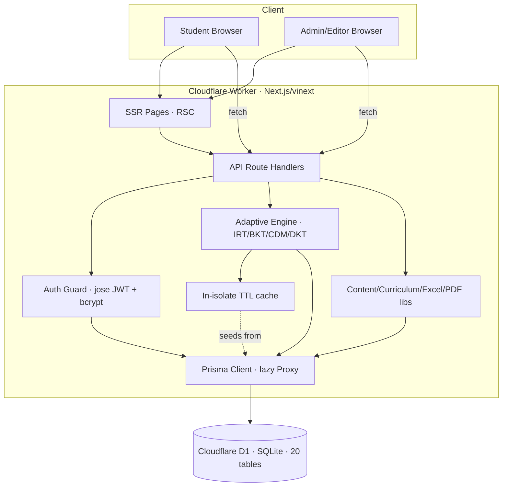

**Explanation.** Both browsers talk to one Worker. Pages render server-side; interactive actions call API handlers. Every privileged handler passes through the auth guard. The engine and content libraries hold business logic and reach D1 through the lazy Prisma client; near-static reads are served from an in-isolate cache to cut round trips.

---

## 9. Technology Stack

| Layer | Technology | Version | Purpose | Reason for selection |
|---|---|---|---|---|
| Framework | Next.js | 16.2.6 | UI + API + SSR/RSC | One codebase; file routing; server components |
| UI runtime | React / React-DOM | 19.2.6 | Component model | Current React; RSC support |
| Language | TypeScript | ^5.9.2 | Types across engine + app | Safety for complex engine state |
| Styling | Tailwind CSS | 4.2.1 | Design system | Consistency without CSS sprawl |
| Charts | Recharts | ^3.2.1 | Report/analytics charts | Declarative React charts |
| Icons | lucide-react | ^1.25.0 | Iconography | Consistent icon set |
| ORM | Prisma (+ @prisma/adapter-d1) | 6.19.3 | Typed data access to D1 | Typed client; D1 driver adapter |
| Database | Cloudflare D1 (SQLite) | — | Persistence | Serverless edge SQLite, free tier |
| Build/host | vinext + @cloudflare/vite-plugin + Vite | 0.0.50 / 1.37.1 / 8.0.13 | Compile Next.js → Worker | Edge deploy target |
| Deploy CLI | wrangler | 4.92.0 | D1 + deploy | Official Cloudflare CLI |
| Auth | jose | ^6.0.11 | JWT sign/verify | Web-Crypto, Workers-safe |
| Hashing | bcryptjs | ^3.0.2 | Password hashing | Pure-JS, Workers-safe |
| PDF | pdfkit (+ @types/pdfkit) | ^0.19.1 | Report PDF export | Programmatic PDF in JS |
| Spreadsheet | xlsx | ^0.18.5 | Excel import/export | Ubiquitous `.xlsx` handling |
| Testing | Vitest | 4.0.17 | Unit tests | Vite-native test runner |
| Scripting | tsx | ^4.20.5 | Run TS scripts (e2e, seed, generate) | Zero-config TS execution |

**Per-technology notes (selected).**
- **Prisma + adapter-d1** — used in `src/lib/db.ts`; solves typed DB access on D1; alternatives: Drizzle (the migration SQL folder is named `drizzle/` but the runtime ORM is Prisma), raw D1. Limitation: D1 SQL subset (e.g. compound-SELECT term cap, §7 of handover). Config: `DATABASE_URL` for local; the `DB` binding for the Worker.
- **jose** — `src/lib/auth.ts`; signs/verifies the session JWT; chosen over `jsonwebtoken` (native crypto unavailable on Workers).
- **bcryptjs** — uses `compareSync`/`hashSync` (Workers-safe); alternative `bcrypt` (native) unavailable on Workers.
- **pdfkit** — `src/lib/pdf/report-pdf.ts` with an embedded Noto font (`noto-font.ts`) for Unicode.
- **xlsx** — `src/lib/excel/parser.ts` + `importer.ts` for the content workbook.

---

## 10. Project Folder & Code Structure

```text
Zarban/
├── prisma/schema.prisma          # 20-model relational schema (source of truth)
├── drizzle/0000_initial.sql      # generated schema+seed for remote D1 (6,680 stmts)
├── src/
│   ├── app/                      # Next.js App Router
│   │   ├── (student pages)       # assessment, practice, learn, report/[id]/analysis
│   │   ├── admin/                # console pages (dashboard, analytics, students, …, database, system)
│   │   ├── content/              # Content Studio pages (skills, questions, curriculum, syllabus, import)
│   │   └── api/                  # 46 route handlers (admin/*, content/*, session/*, learn, practice)
│   ├── lib/
│   │   ├── db.ts                 # lazy Prisma client over D1 binding
│   │   ├── auth.ts               # JWT + bcrypt + RBAC guards
│   │   ├── audit.ts              # append-only audit writer
│   │   ├── engine/               # IRT, BKT, CDM, DKT, orchestrator, fetch-question, report, cache…
│   │   ├── admin/db-admin.ts     # generic table introspection + parameterized CRUD
│   │   ├── content/              # health, question/skill helpers + validation
│   │   ├── curriculum/           # NCERT data, syllabus builder, subject blurbs
│   │   ├── excel/                # xlsx parser + importer
│   │   └── pdf/                  # pdfkit report + embedded font
│   └── generated/prisma/         # generated Prisma client (do not edit)
├── scripts/                      # e2e.ts, seed*.ts, generate/verify-workbook.ts, export-d1-migration.py, patch-d1.mjs
├── tests/                        # Vitest unit tests
├── docs/                         # documentation + screenshots + guide
├── public/                       # static assets
├── package.json / wrangler(build config via vinext) / vite.config.ts / tsconfig.json
```

**Classification:** `prisma/` = data; `src/app/**/page.tsx` = UI; `src/app/api/**` = application/API; `src/lib/**` = business logic/config; `scripts/` = tooling; `tests/` = test; `drizzle/` + `scripts/patch-d1.mjs` = deployment/data. Engine files are explained in §21; DB in §14.

---

## 11. Frontend Explanation

- **Entry / shells:** student pages render standalone; the admin console uses `src/app/admin/layout.tsx` (sidebar + auth guard via `GET /api/admin/auth/me`); Content Studio pages sit under `src/app/content/`.
- **State management:** React hooks + `localStorage` (assessment in-progress state `zarban_assessment`); no global store (no Redux/Zustand present).
- **API calls:** `fetch` to the route handlers; JSON.
- **Auth handling:** cookie-based; the admin layout redirects to `/admin/login` on 401.
- **Validation:** client checks (required fields, option selection) + server validation.
- **Loading/error/empty states:** skeleton loaders (`.skeleton`), inline error banners, empty-state cards.
- **Responsive/styling:** Tailwind utilities; theme-aware components; page cross-fade templates.
- **Charts/tables:** Recharts (report, analytics); HTML tables (question bank, DB manager, audit).
- **Search/filter/sort/pagination:** question bank filters; DB-manager search + pagination.

### 11.1 Key screens (selected)

| Screen | Purpose | Roles | Key elements | Primary API |
|---|---|---|---|---|
| `/` Landing | Start a test | Student | name/school/grade, Start | `session/start` |
| `/assessment` | Take test | Student | question card, A–D, timer, progress | `session/respond` |
| `/report/[id]` | Diagnosis | Student/Teacher | gauge, root-cause, behaviour, dimensions | `session/report/[id]` |
| `/report/[id]/analysis` | Replay | Student/Teacher | θ chart, path grid, time chart | (same session data) |
| `/practice` | Drill | Student | skill grid, runner | `practice` |
| `/admin/login` | Sign in | Staff | email, password | `admin/auth/login` |
| `/admin` | Dashboard | Analytics roles | tiles, gaps, heatmap | `admin/stats` |
| `/admin/analytics` | Cohorts | Analytics roles | 3 charts | `admin/analytics` |
| `/admin/database` | DB manager | Admin | table list, grid, edit/delete | `admin/db*` |
| `/content/skills` | Graph | Editor/Admin | SVG graph, detail panel | `content/skills*` |

Full screen-by-screen coverage is in §18. *Information not available in the supplied project files for exact pixel-level layouts beyond the captured screenshots in `docs/screenshots/`.*

---

## 12. Backend Explanation

- **Startup/config:** the Worker boots from the vinext build; the D1 `DB` binding is injected per request; `src/lib/db.ts` constructs the Prisma client lazily.
- **Routes/controllers:** each `src/app/api/**/route.ts` exports HTTP handlers; they parse input, run a guard, call a lib function, and return JSON.
- **Services/models:** `src/lib/engine/*` (assessment), `src/lib/content/*` (authoring), Prisma models = data models.
- **Middleware/auth/authz:** `requireRole`/`requireContentRole` (called at the top of each handler; there is no Next.js `middleware.ts` global — *auth is per-handler*).
- **Business logic:** orchestrator (§21), report generator, content health, syllabus builder.
- **Validation:** `src/lib/content/question-validate.ts`, `src/lib/validate-question.ts`, settings clamps, URL checks.
- **Exception handling:** try/catch → `NextResponse.json({error}, {status})`.
- **Logging:** `console.error` on failure paths.
- **Background jobs:** none at runtime. Content generation is offline scripts.
- **File processing:** Excel (`xlsx`) import/export; PDF (`pdfkit`) generation.
- **DB connection:** via the D1 binding; no connection pool (edge model).
- **Env vars:** `AUTH_SECRET` (JWT), `DATABASE_URL` (local), the `DB` binding (Worker). See §29.

---

## 13. API Documentation

46 handlers. All admin/content routes require the `zarban_admin` JWT cookie and a sufficient role; session/practice/learn are public (student-facing). Common error shape: `{ "error": "message" }` with an appropriate status. Representative endpoints below; the rest follow the same conventions.

### API: Start session
- **Endpoint:** `/api/session/start` · **Method:** POST · **Auth:** none.
- **Body:** `{ name, school?, email?, grade }`. **Validation:** `name` required; `grade` clamped to 5–10.
- **Processing:** reuse student by email if present, else create; `startSession` → first question. **DB:** `students` (read/create/update), `sessions` (create), `questions`/`answer_traps` (read).
- **Success 200:** `{ student_id, session_id, step:{ question, … } }`. **Errors:** 400 "Name is required"; 500 on engine failure.

### API: Submit response
- **Endpoint:** `/api/session/respond` · **Method:** POST · **Auth:** none.
- **Body:** `{ session_id, question_id, selected_option, response_time_ms? }`. **Validation:** the three ids/option required.
- **Processing:** `processResponse` (grade → CDM → BKT → DKT → IRT → route → persist → serve). **DB:** many (see §5.1).
- **Success 200:** `{ step:{ done?, question?, decision, bkt?, theta? } }`. **Errors:** 404 "Session/Question not found"; 500.

### API: Get report / PDF
- **Endpoint:** `/api/session/report/[sessionId]` (GET) and `…/pdf` (GET) · **Auth:** none.
- **Processing:** `generateReport`; PDF via `pdfkit`. **Success:** JSON report / `application/pdf`. **Errors:** 404 if unknown session.

### API: Admin login
- **Endpoint:** `/api/admin/auth/login` · **Method:** POST · **Auth:** none (issues auth).
- **Body:** `{ email, password }`. **Processing:** `bcrypt.compareSync` → `jose` sign → `Set-Cookie zarban_admin` (HttpOnly, Secure, SameSite=Lax, Max-Age 43200). **Success 200:** `{ user }`. **Errors:** 400 missing; 401 invalid.

### API: Database manager (Admin)
- **`/api/admin/db` (GET):** list tables + counts.
- **`/api/admin/db/[table]` (GET/PATCH/DELETE):** page/search rows; update/delete a row by `rowid`. **Security:** table/column whitelisted vs live schema; values parameterized; every write audited (`db.update_row`/`db.delete_row`). **Errors:** 400 "Unknown table" on injection attempt; 401 without Admin.

### API: Settings (Admin)
- **`/api/admin/settings` (GET/PUT):** read/upsert `max_questions` (5–100) and `test_timer_minutes` (0–180); PUT invalidates the settings cache and writes an audit entry.

*Remaining endpoints* (students, classrooms, questions, skills, curriculum subjects/topics/textbooks, analytics, stats, audit, maintenance, import/export, replay, learn, practice, me, logout) follow identical patterns: guard → validate → Prisma op → typed JSON. Full per-field request/response schemas beyond the above are *derivable from the route files*; exhaustive body schemas for all 46 are **not restated here** to keep this document navigable — the source route handlers are authoritative.

### 13.1 Sequence — submit an answer

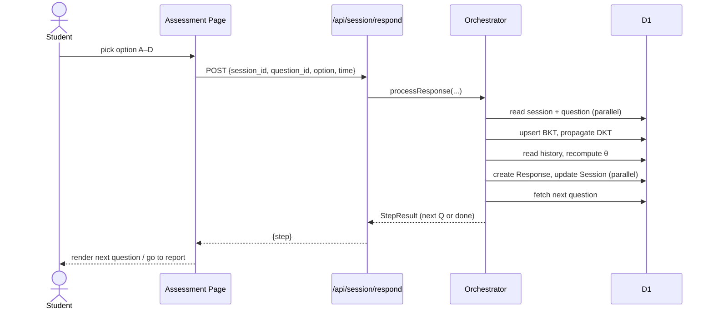

---

## 14. Database Design

**Technology:** Cloudflare D1 (SQLite dialect). **Purpose:** relational store for curriculum, learners, sessions, engine state, and ops. **20 tables** (snake_case via Prisma `@map`). Audit fields: `created_at`/`started_at`/`responded_at`/`last_updated` defaults. **Soft-delete:** none — deletes are hard, with FK cascade. **Backup:** none configured (**Recommendation:** scheduled `wrangler d1 export`). **Retention:** indefinite; a "reset learner history" maintenance action exists.

### 14.1 Key tables (columns → type · constraint · purpose)

**skills** — assessable math skills (engine topics).

| Column | Type | Constraint | Purpose |
|---|---|---|---|
| skill_id | String | PK | Stable skill code (e.g. S_016) |
| skill_name | String | not null | Display name |
| grade_level | String? | — | Grade(s), e.g. "9-10" |
| topic_area | String? | — | Arithmetic/Algebra/Geometry/Statistics |
| difficulty_band | String? | — | Baseline band |
| prerequisite_skill_ids | String? | — | Raw CSV (parsed into graph) |

**questions** — item bank. PK `question_id`; FKs `primary_skill_id`→skills, `equation_twin_id`→questions (self, twin); IRT `irt_a/b/c` (defaults 1.0/0.0/0.25); indexes `(primary_skill_id, grade_level, difficulty_band)` and `(grade_level, difficulty_band)`.

**answer_traps** — misconception mapping per wrong option. PK `id` (autoincrement); FK `question_id`; unique `(question_id, option_label)`; `trap_type`, `remedial_action`, `remedial_skill_id`, `remedial_grade`.

**knowledge_graph** — prerequisite edges. Composite PK `(child_skill_id, parent_skill_id)`; both FK→skills (cascade); index `(parent_skill_id)`.

**sessions** (`AssessmentSession`) — a test attempt. PK `session_id` (uuid); FK `student_id`; engine state (`current_theta`, `current_skill_id`, `consecutive_correct/failures`, `twin_probe_pending`, `bands_served`, `visited_skills`, `return_skill_id`, `max_questions`); `status` (`in_progress|completed`), `termination_reason`; index `(student_id)`.

**responses** — one row per answered item. PK `response_id`; FKs `session_id`(cascade), `question_id`; snapshot fields for replay (`served_*`, `engine_decision`, `theta_after`, `p_mastery_after`, `response_time_ms`); index `(session_id)`.

**bkt_state** — mastery per student×skill. Composite PK `(student_id, skill_id)`; `p_mastery` (default 0.10), `attempts`.

**dimension_scores** — per-session five-dimension percentages (PK `session_id`).

**traversal_events**, **review_flags** — prerequisite-traversal log and teacher review flags (FK `session_id`, cascade).

**students** — PK `student_id` (uuid); `email` unique; FK `classroom_id`→classrooms (SetNull); index `(classroom_id)`.

**classrooms** — PK `classroom_id`; FK `teacher_id`→admin_users (SetNull); index `(teacher_id)`.

**admin_users** — PK `id`; `email` unique; `password_hash`; `role` (default Viewer).

**subjects / topics / textbooks** — NCERT curriculum catalog; `subjects.name` unique; `textbooks.pdf_url` (external soft-copy link); indexes on grade.

**settings** — PK `key`, `value`. **admin_audit_log** — append-only; index `(created_at)`.

### 14.2 Relationships
- **One-to-many:** Skill→Question (`primarySkill`), Session→Response, Student→Session, Student→BktState, Subject→Topic, Subject→Textbook, Classroom→Student, AdminUser→Classroom (teacher).
- **One-to-one:** Session→DimensionScore; Question→QuestionDimension.
- **Many-to-many:** Question↔Skill via `q_matrix` (secondary skills); Skill↔Skill via `knowledge_graph` (prereq graph).
- **Self-reference:** Question→Question (`equation_twin_id`).
- **Cascade:** deleting a Session cascades to responses/dimension_scores/traversals/review_flags; deleting a Student cascades to sessions + bkt_state; deleting a Question cascades to traps/q_matrix/dimensions.

### 14.3 ER diagram (core)

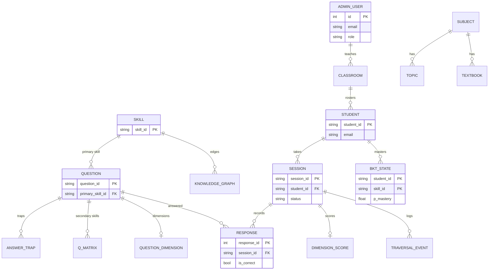

---

## 15. Data Flow

### 15.1 Context diagram

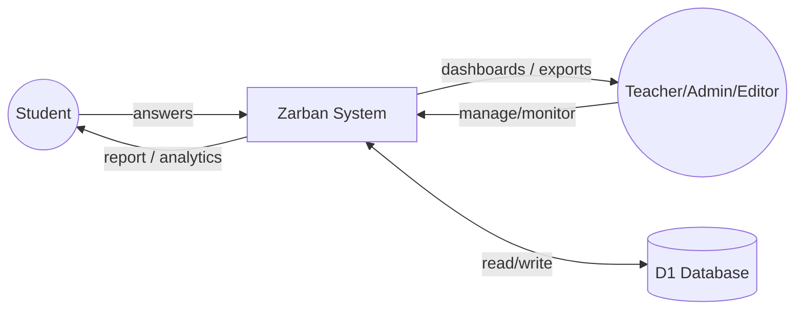

### 15.2 Level-1 (assessment)

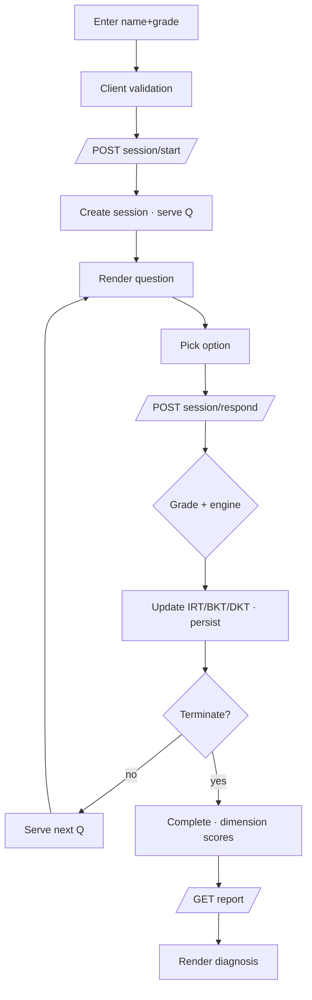

**Explanation.** Input is validated client-side, sent to the API, processed by the engine (which reads/writes D1), and either loops to the next question or terminates into a report. Logging is `console.error` on failures; notifications are client toasts; exports are the PDF/Excel endpoints.

---

## 16. Complete Workflow

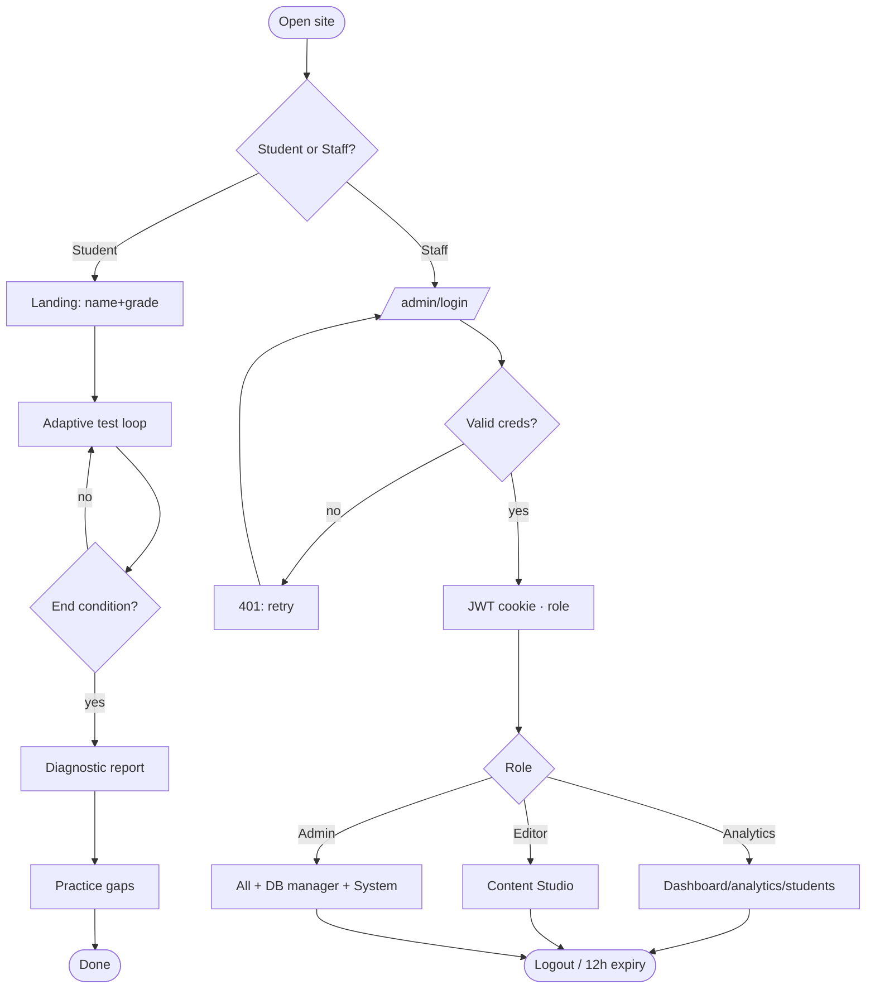

**End/expiry:** the JWT max-age is 12h; logout clears the cookie. Error recovery: invalid login re-prompts; engine "not found" → 404; destructive actions require a typed phrase.

---

## 17. Detailed User Walkthrough (with realistic data)

### 17.1 Student (Aarav, Class 8)
1. **Sees:** landing hero + start card. **Enters:** name "Aarav", school "DAV", class **8**. **Validation:** name required, grade clamped. **Internally:** `POST /api/session/start` creates `Student` + `AssessmentSession`; reads `questions`. **Result:** first question appears.
2. **Sees:** a question with A–D. **Clicks:** an option (or presses B). **Internally:** `POST /api/session/respond` → `processResponse` updates `bkt_state`, `responses`, `sessions`; fetches next. **Result:** next question; on a wrong word-problem, a twin equation may appear. **On error:** one silent retry, then an inline banner.
3. **Continues** ~20–30 items until termination. **Internally:** `endSession` sets `status=completed`, writes `dimension_scores`. **Result:** redirect to `/report/<id>`.
4. **Sees:** grade estimate, root-cause diagnosis, behaviour flags. **Clicks:** "Detailed analysis" → θ journey + path grid. **Optionally:** downloads the PDF (`…/pdf`).
5. **Next:** opens `/practice`, picks a flagged skill, drills with instant feedback.

### 17.2 Admin (staff)
1. **Opens** `/admin/login`, enters `admin@zarban.local` / `admin123`. **Internally:** bcrypt verify → JWT cookie. **On error:** 401 "Invalid credentials".
2. **Dashboard** loads (`/api/admin/stats`): tiles, top gaps, heatmap.
3. **Students → open one:** per-student mastery drill-down; assign a classroom (`PATCH /api/admin/students/[id]`).
4. **Question Bank:** filter by grade/skill; edit an item; or **Import** an `.xlsx`.
5. **Database manager:** open `questions`, search "AP", edit a row (`PATCH /api/admin/db/questions`) — audited.
6. **System & Audit:** review the audit log; if needed, run a maintenance reset (type the phrase).
7. **Logout** clears the cookie.

### 17.3 Editor
Signs in (Editor), opens **Content Studio → Skills & Graph**, adds a skill (prereqs parsed into `knowledge_graph`), authors a question (validated), and exports the workbook. Restricted: no Administration/Database.

### 17.4 Teacher/Viewer
Teacher: dashboard, classrooms (own via "Mine"), student drill-downs; **cannot** write content or manage staff. Viewer: read-only; write attempts → 403.

---

## 18. Screen-by-Screen Walkthrough

For brevity each screen lists access + key elements + backend. Screenshots exist in `docs/screenshots/`; placeholders below map to them.

1. **Landing** `[Insert Screenshot: Landing Page]` — Student. Hero, start card (name/school/class 5–10), Start. → `session/start`. *Visible:* CAT·IRT·CDM·BKT footnote, "Teacher/Admin" link.
2. **Assessment** `[Insert Screenshot: Assessment]` — Student. Topic breadcrumb, timer, progress bar, question card, A–D buttons, "Recording your answer…". → `session/respond`.
3. **Report** `[Insert Screenshot: Report]` — Student/Teacher. Grade header + gauge, Root Cause, Test-Taking Behaviour, Five Dimensions (radar), Error Patterns. → `session/report/[id]`.
4. **Analysis** `[Insert Screenshot: Analysis]` — θ line, adaptive-path grid (legend: easy/medium/hard, twin, guess, rushed), time-per-question bars.
5. **Practice** `[Insert Screenshot: Practice]` — grade-grouped skill grid + runner.
6. **Admin login** `[Insert Screenshot: Admin Login]` — email/password/Sign in.
7. **Dashboard** `[Insert Screenshot: Dashboard]` — sidebar (grouped nav), 4 stat tiles, Top skill gaps, Quick actions, Score by grade, Heatmap. → `admin/stats`.
8. **Cohort Analytics** `[Insert Screenshot: Analytics]` — trend line, error-type bars, prerequisite-gap tracker.
9. **Students** `[Insert Screenshot: Students]` — searchable list; row → drill-down.
10. **Classrooms** `[Insert Screenshot: Classrooms]` — list/empty state, New classroom, All/Mine, roster.
11. **Question Bank** `[Insert Screenshot: Question Bank]` — filters, search, grid (id/skill/grade/band/traps), Edit/Delete, Excel Import.
12. **Syllabus** `[Insert Screenshot: Syllabus]` — grade tabs, textbook/chapter counts, subjects.
13. **User Access** `[Insert Screenshot: Users]` — staff list, roles (Admin only).
14. **Settings** `[Insert Screenshot: Settings]` — max questions, timer minutes.
15. **System & Audit** `[Insert Screenshot: System]` — data snapshot tiles, danger zone (typed phrase), audit table.
16. **Database manager** `[Insert Screenshot: Database]` — table list + counts, row grid (PK badge, edit/delete), search, pagination.
17. **Content: Skills & Graph** `[Insert Screenshot: Skills Graph]` — SVG graph, node selection, Graph/Table toggle, detail panel.
18. **Content: Curriculum / Questions / Import** — subject/topic/textbook editors; question authoring; Excel import/export.

Under each placeholder, the listed elements describe every visible control, its action, validation, and the backend call.

---

## 19. Authentication & Authorization Workflow

- **Registration:** *not present for staff* (accounts are seeded / created by an Admin via User Access). Students have **no** auth.
- **Login:** `POST /api/admin/auth/login` → `bcrypt.compareSync(password, hash)` → `jose` HS256 sign `{userId,email,name,role}` → `Set-Cookie zarban_admin` (HttpOnly, Secure, SameSite=Lax, Max-Age 43200s).
- **Session storage:** stateless JWT in the cookie (no server session table).
- **Role identification / permission checking:** `requireRole(min)` decodes the cookie, checks rank; `requireContentRole()` allows Admin/Editor.
- **Protected routes:** every admin/content handler calls a guard first; the admin layout also verifies via `GET /api/admin/auth/me`.
- **Expiration:** 12h token; **logout** (`POST /api/admin/auth/logout`) clears the cookie.
- **Password reset / brute-force / lockout:** *not implemented.* **Recommendation:** add reset flow + rate limiting + lockout.

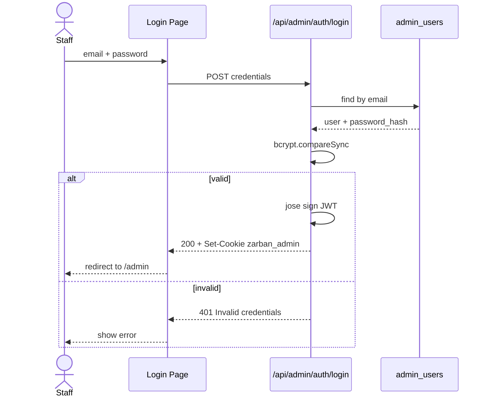

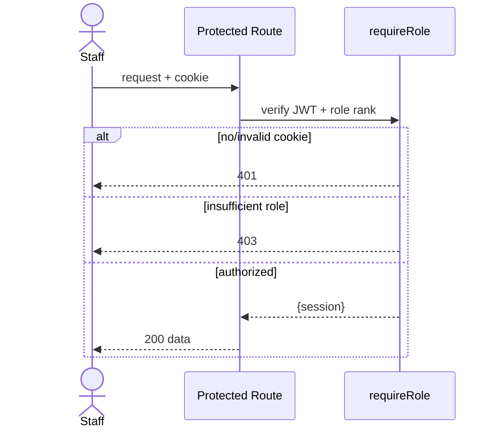

---

## 20. Business Rules & Calculation Logic

| Rule ID | Name | Logic / threshold | Code location |
|---|---|---|---|
| BR-01 | Mastery reached | `p_mastery ≥ 0.95` → advance topic | `types.ts` MASTERY_THRESHOLD, orchestrator |
| BR-02 | Foundational gap | `p_new ≤ 0.30` AND (attempts ≥ 3 OR fail-streak ≥ 2) → traverse prereq | orchestrator `routeWrongAnswer` |
| BR-03 | Careless slip | trap=Careless_Slip AND prior ≥ threshold → retry, no regression | orchestrator |
| BR-04 | Lucky-guess guard | correct AND prior < LUCKY_GUESS_PRIOR → serve confirmation | orchestrator `routeCorrectAnswer` |
| BR-05 | Streak escalate | 2 consecutive correct → escalate band; all bands served → advance | orchestrator |
| BR-06 | Easy-fail traversal | difficulty=easy AND fail-streak ≥ 2 → cross-grade traverse | orchestrator |
| BR-07 | Twin probe | wrong word-problem with a twin → serve equation twin | orchestrator |
| BR-08 | Termination | max_questions reached / timer / all mastered / topics exhausted | orchestrator |
| BR-09 | Behaviour flags | rushed = time < 3000 ms; likely-guess = rushed AND correct AND band ≥ medium | `report.ts` |
| BR-10 | Settings clamps | max_questions∈[5,100]; timer∈[0,180] | `admin/settings` |
| BR-11 | DKT propagation | child p_mastery += coeff × (p_new − prior) | orchestrator `propagateDkt` |

**Worked example (BKT update).** With P(L₀)=0.10, P(T)=0.3, P(G)=0.2, P(S)=0.1 and a **correct** answer: posterior `P(L|correct) = P(L)(1−S) / [P(L)(1−S) + (1−P(L))G]` = `0.10·0.9 / (0.10·0.9 + 0.90·0.2)` = `0.09 / 0.27` = **0.333**; then learn: `P(L') = 0.333 + (1−0.333)·0.3` = **0.533**. So one correct answer lifts mastery from 0.10 → ~0.53.

---

## 21. Algorithms

### 21.1 Adaptive orchestration (`processResponse`)
- **Purpose:** grade an answer and choose the next question. **Input:** session id, question id, option, time. **Output:** `StepResult`.
- **Steps:** load session+question → grade → CDM trap lookup (if wrong) → BKT update + DKT propagation → IRT θ recompute over history → update counters → route (correct/wrong/twin decision tree) → persist response + session → check termination → serve next.
- **Complexity:** per answer O(n) in the number of prior responses (θ recompute); O(1) DB ops otherwise. **Space:** O(n) for history.
- **Edge cases:** twin missing, skill exhausted, timer expiry. **Optimization applied:** parallelized reads/writes + cached reference data (§31).

### 21.2 3PL IRT θ estimation (`irt.ts`)
Newton–Raphson MLE maximizing the 3PL likelihood; θ clamped [−4,4]. Item chosen by max Fisher information (|b−θ| minimal, tie → higher a). Pseudocode:
```
θ ← current
repeat until |Δ| < ε or maxIter:
  compute Σ first/second derivatives of log-likelihood over responses
  θ ← clamp(θ − L'/L'', -4, 4)
```

### 21.3 BKT (`bkt.ts`)
Exact two-step posterior + learning update (worked in §20). O(1).

### 21.4 CDM remediation, DKT-lite, Twin-probe, CAT fetch ladder — described in §5.1/§20 and the technical handover; each is O(1)–O(candidates).

---

## 22. External Integrations

**No third-party runtime service integrations are present** (no payment, email, SMS, analytics SDK, or LLM calls in the codebase). The only external references are **NCERT textbook soft-copy URLs** stored in `textbooks.pdf_url` — these are links surfaced in the UI, not fetched/processed by the backend. Cloudflare (Workers/D1) is the hosting platform, not an application integration. *Information not available in the supplied project files* for any other external service.

---

## 23. Error Handling Catalogue

| Error | Cause | User message | Internal action | Recovery |
|---|---|---|---|---|
| Validation | Missing name/fields | "Name is required" etc. | 400 JSON | Re-enter |
| Auth (401) | No/invalid JWT | Redirect to login | 401 | Sign in |
| Authorization (403) | Insufficient role | Access blocked | 403 | Use permitted role |
| Not found (404) | Unknown session/question/record | "… not found" | 404 | Check id |
| DB error | Query failure | Generic error | `console.error` + 500 | Retry |
| Network | Fetch failure (client) | Inline banner | one silent retry | Tap to retry |
| API error | Bad input | `{error}` + status | validation | Correct input |
| Duplicate | Unique constraint (email/name/key/trap) | Constraint message | 4xx | Use unique value |
| Invalid URL | Bad `pdf_url` | 400 | reject | Fix URL |
| Injection attempt | Bad table/column name | "Unknown table" | 400 (whitelist) | — |
| Server error | Unhandled | Generic | 500 + log | Retry/report |
| Session expiry | JWT > 12h | Redirect to login | 401 | Re-login |

---

## 24. Edge Cases

| Case | Current handling | Improvement (Recommendation) |
|---|---|---|
| Empty input | Required-field validation | Add richer inline hints |
| Null values | Nullable columns; null-safe UI ("null" shown in DB manager) | — |
| Wrong format | URL check; grade clamp | Add schema validation (zod) |
| Duplicate entries | Unique constraints | Friendlier duplicate messages |
| Very large inputs | Page size capped (≤200) | Server-side result caps everywhere |
| Negative/invalid grade | `clampGrade` to 5–10 | — |
| Invalid/future dates | *N/A — few user-entered dates* | — |
| Missing relationships | Engine fallbacks (skill/twin missing) | — |
| Deleted users | `teacher_id` SetNull; audit keeps `actor_email` | — |
| Simultaneous updates | Last-write-wins (no optimistic lock) | Add version/ETag |
| Network failure | One silent client retry | Exponential backoff |
| DB disconnection | Handler 500 | Retry/circuit-breaker |
| Partial/invalid file upload | `xlsx` parse errors surfaced | Stricter schema + row-level errors |
| Session expiry | 401 → login | Refresh tokens |
| Unauthorized access | 401/403 guards | Rate-limit + lockout |
| API timeout | *not explicitly handled* | Add timeouts/AbortController |

---

## 25. Security

**Implemented:** RBAC (four roles, per-handler guards); bcrypt password hashing; JWT in HttpOnly+Secure+SameSite=Lax cookie; parameterized SQL everywhere incl. the DB manager (identifier whitelisting + bound values); audit log of privileged actions; HTTPS (Cloudflare); secrets via `AUTH_SECRET` Worker secret; typed-phrase confirmation on destructive actions; Prisma prevents SQL injection in ORM paths.

**Missing / not evidenced:** rate limiting; account lockout / brute-force protection; password reset; CSRF tokens (mitigated by SameSite=Lax, but state-changing POSTs have no explicit CSRF token — *Recommendation: add CSRF defense or verify SameSite coverage*); CSP headers (*Info not available*); dependency-scanning/CI; formal secrets rotation; file-upload AV scanning; per-IP throttling.

**Recommendations (prioritized):** (1) rate-limit auth + login lockout; (2) password reset flow; (3) explicit CSP + security headers; (4) dependency audit in CI; (5) rotate `AUTH_SECRET` policy; (6) backups with restricted access.

---

## 26. Testing

**Implemented:**
- **End-to-end:** `scripts/e2e.ts` (`npm run e2e`) — **136 checks** over the real HTTP API: assessment lifecycle (all-correct and all-wrong), report + analysis, admin auth + every admin view, content portal, and RBAC denial (403). Correct answers read from local D1.
- **Unit:** Vitest present (`tests/`, `vitest.config.ts`). *Exact unit count/coverage not enumerated here — Info not available beyond the presence of the suite.*
- **Type checking:** `tsc --noEmit` gates changes.
- **Content QA:** `scripts/verify-workbook.ts` gates the question bank.

**Not evidenced:** load testing, formal security testing, cross-browser matrix, UAT sign-off. *Info not available.* **Recommendation:** add load tests (k6), a browser matrix, and a security scan.

### Sample test cases

| Test ID | Module | Scenario | Steps | Input | Expected | Type |
|---|---|---|---|---|---|---|
| TC-01 | Assessment | Start valid | POST start | name+grade 8 | 200 + first Q | Positive |
| TC-02 | Assessment | Start missing name | POST start | grade only | 400 | Negative |
| TC-03 | Respond | Unknown session | POST respond | bad session_id | 404 | Negative |
| TC-04 | Auth | Valid login | POST login | admin creds | 200 + cookie | Positive |
| TC-05 | Auth | Invalid login | POST login | wrong pw | 401 | Negative |
| TC-06 | RBAC | Viewer writes | POST classrooms as Viewer | — | 403 | Security |
| TC-07 | Settings | Clamp bounds | PUT settings | maxQ=999 | stored=100 | Boundary |
| TC-08 | DB manager | Injection | GET db/`skills;DROP` | — | 400 Unknown table | Security |
| TC-09 | Curriculum | Bad pdf_url | POST textbook | "notaurl" | 400 | Validation |
| TC-10 | Report | Unknown session | GET report | bad id | 404 | Exception |

*Actual/Status columns to be filled during a test run; the e2e suite currently reports 136 passed / 0 failed.*

---

## 27. Deployment

**Prerequisites:** Node.js, a Cloudflare account, `wrangler`. **Hardware:** none (serverless). **Software:** repo dependencies (`npm install`).

**One-time:**
```bash
npx wrangler login
npx wrangler d1 create zarban            # capture database_id
npx wrangler d1 execute zarban --remote --file=drizzle/0000_initial.sql -y
```
**Every deploy:**
```bash
npm run build
node scripts/patch-d1.mjs <database_id>  # writes the DB binding into dist/server/wrangler.json
npx wrangler deploy                       # from the repo ROOT
```
**Hardening:** `npx wrangler secret put AUTH_SECRET`.

**Hosting:** frontend + backend + DB all on Cloudflare (Workers + D1) — one artifact. **Domain/HTTPS:** `*.workers.dev` subdomain with auto TLS (custom domain optional; §8 of handover). **Reverse proxy / containers / CI/CD / rollback:** *not applicable / not configured* (edge platform; rollback via Worker version pinning in the dashboard). **Backup/recovery:** *not configured* — **Recommendation:** scheduled `wrangler d1 export`.

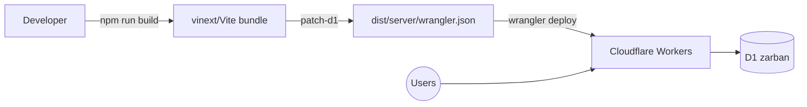

---

## 28. Installation & Setup Guide (local)

1. **Required software:** Node.js (LTS), npm, Git. 2. **Download:** `git clone https://github.com/karthikLagudu/Zarban`. 3. **Navigate:** `cd Zarban`. 4. **Install:** `npm install`. 5. **Config:** set `DATABASE_URL` for local SQLite (see `.env` / `datasource db`). 6. **Env:** `AUTH_SECRET` (dev fallback exists). 7. **Database + sample data:** `npm run setup` (chains `db:push` → `generate:workbook` → `verify:workbook` → `seed`). 8. **Run:** `npm run dev`. 9. **URL:** http://localhost:3000. 10. **Default login:** `admin@zarban.local` / `admin123` (and `editor@zarban.local` / `editor123`). 11. **e2e:** `npm run e2e`.

**Common setup issues:** if the local D1 schema is stale, re-run `db:push` and the sqlite-apply step; if the client build breaks, ensure no client component imports a server-only module. **Troubleshooting:** see §33.

---

## 29. Configuration & Environment Variables

| Variable | Purpose | Required | Example | Security note |
|---|---|---|---|---|
| `AUTH_SECRET` | JWT signing secret | Prod: yes (dev fallback exists) | `‹48-byte-random›` | Set via `wrangler secret`; never commit |
| `DATABASE_URL` | Local SQLite datasource | Local: yes | `file:./dev.db` | Local only |
| `DB` (binding) | Cloudflare D1 binding | Worker: yes | *(binding, not a value)* | Configured in `wrangler.json` |

*No other secrets are present.* Real credentials must never be committed; use placeholders as above.

---

## 30. Logging & Monitoring

**Implemented:** `console.error` on failure paths; the **audit log** (`admin_audit_log`) records privileged actions (`auth.login`, `user.*`, `settings.update`, `data.*`, `db.update_row`, `db.delete_row`). **Not implemented:** access logs, log levels/rotation, metrics dashboards, alerting, external log sink. *Information not available in the supplied project files.* **Recommendation:** ship Workers logs to a sink, add structured logging + alerts, and surface Cloudflare analytics.

---

## 31. Performance & Scalability

**Current implementation & measured results (production):**

| Path | Before | After | Improvement |
|---|---|---|---|
| Assessment answer | ~480–610 ms | ~280–340 ms | ~45% (+ removed 350 ms client delay) |
| Dashboard stats | ~311 ms | ~170 ms | ~45% |
| Content hub | ~313 ms | ~150 ms | ~52% |
| Report | ~267 ms | ~215 ms | ~20% |

**Techniques:** parallelized independent D1 reads/writes; use of `update()` return instead of re-reads; an in-isolate TTL cache for near-static data; trimmed history projections; skipping impossible checks. **Indexing:** composite indexes back the hot fetch paths. **Pagination:** DB manager (≤200/page). **Bottlenecks / limits:** D1 single-primary writes; module caches are best-effort per isolate; θ recompute is O(n) per answer. **Scaling:** Workers scale horizontally automatically; **Recommendation:** persist item params to avoid O(n) recompute, and consider read-replicas/edge-cache for analytics.

---

## 32. Maintenance Guide

- **Dependencies:** periodic `npm update` + `npm audit`. **DB backup:** `wrangler d1 export` (Recommendation — add a schedule). **Restore:** `wrangler d1 execute --file=<backup>.sql`. **Log review:** audit log + Worker logs. **User management:** `/admin/users`. **Security updates:** patch deps; rotate `AUTH_SECRET`. **Config changes:** `/admin/settings` (cache auto-invalidates). **Data cleanup:** System → maintenance (typed phrase). **Content updates:** Content Studio or Excel import → re-run `verify-workbook` for bulk changes. **Version upgrades:** bump deps, `tsc`, `e2e`, redeploy. **Feature additions:** follow the migration dance (§ handover Phase 1) for schema changes.

---

## 33. Troubleshooting Guide

| Problem | Possible cause | Diagnostic steps | Solution |
|---|---|---|---|
| Local login fails | Seed not loaded | `npm run setup` ran? | Re-seed; use demo creds |
| "DB binding unavailable" | Running outside Worker context | Check `src/lib/db.ts` proxy | Access via a request handler |
| Client build breaks | Client imports server module | Trace import of `db.ts` | Split client-safe constants |
| Deploy config collision | Deployed from `dist/server` | Read error | Deploy from repo root |
| HTTPS fails post-subdomain change | Cert not issued yet | `curl` exit 35 | Wait; poll until 200 |
| DB manager count error | Query limit | Check D1 error | Concurrent per-table counts (in place) |
| 403 on a page | Insufficient role | Check `role` in token | Use Admin/Editor as needed |
| Excel import rejected | Wrong file / schema | Check parser error | Provide valid `.xlsx` |
| Slow answer | Cold isolate | Re-test warm | Caches warm after first calls |
| `git push` hangs | HTTP/2 + expired creds | Try HTTP/1.1 | Re-auth GitHub; force HTTP/1.1 |

---

## 34. Project Strengths

- **Functional design:** a genuine closed-the-loop diagnostic (test → cause → practice).
- **Architecture:** single edge artifact; clean layering; lazy DB proxy.
- **UX:** instant-submit test, skeletons, transitions, empty/error states.
- **Data management:** typed schema, cascade integrity, a generic DB manager, Excel + PDF I/O.
- **Maintainability:** modular engine, scripts, e2e harness.
- **Security:** RBAC + bcrypt + HttpOnly JWT + audit + parameterized SQL.
- **Performance:** measured, behaviour-preserving optimization.
- **Scalability:** horizontal by platform default.
- **Reporting:** rich diagnostic + cohort analytics.
- **Automation:** parametric question generation + QA gate + 136 e2e checks.

---

## 35. Limitations & Technical Debt

| Item | Impact | Severity | Recommended correction |
|---|---|---|---|
| No automated backups | Data-loss risk | High | Scheduled `wrangler d1 export` |
| No rate limit / lockout | Brute-force exposure | High | Add throttling + lockout |
| Demo creds in seed | Unauthorized access if unchanged | High | Force change on first prod login |
| Best-effort caches | Cross-isolate inconsistency (≤TTL) | Low | Acceptable; document TTLs |
| θ recompute O(n)/answer | Grows with test length | Medium | Persist item params on responses |
| No monitoring/alerting | Blind to incidents | Medium | Add Workers analytics + alerts |
| No password reset | Ops friction | Medium | Add reset flow |
| Unit-test coverage unquantified | Unknown gaps | Medium | Measure + expand coverage |
| No CI/CD | Manual deploys | Medium | Add pipeline + checks |
| Single-region D1 | Write latency far from primary | Low/Med | Consider replicas/caching |
| English only | No localization | Low | i18n if needed |

---

## 36. Future Enhancements

- **Immediate:** scheduled backups; force-change demo passwords; auth rate-limit/lockout; monitoring/alerts.
- **Short-term:** password reset; CSP/security headers; CI/CD with `tsc`+`e2e`; persist IRT params to responses.
- **Medium-term:** parent portal; adaptive practice paths driven by the report; item-parameter recalibration from real data; richer accessibility (WCAG audit).
- **Long-term:** multi-subject expansion; offline/PWA mode; multi-tenant schools; localization.

For each: *Purpose* (close a gap), *Business benefit* (trust/reach), *Technical benefit* (safety/perf), *Approach* (as noted), *Dependencies* (platform features), *Priority/Complexity/Risk* (security items = high priority/low risk; multi-tenant = long-term/high complexity).

---

## 37. Project Demonstration Script (speakable)

> "Good morning. I'm presenting **Zarban**, an adaptive math assessment platform for Grades 5 to 10.
> **The problem:** an ordinary test gives a score, but a score doesn't tell a teacher *why* a student struggled or what to do next.
> **Our solution:** Zarban adapts to each student as they answer and produces a diagnosis — for example, 'strong at the maths, but word problems reveal a reading gap.'
> **The stack:** Next.js and React on the front, a closed-form adaptive engine in TypeScript, Prisma over Cloudflare's D1 database, all deployed as a single Cloudflare Worker.
> **Architecture:** one edge Worker serves the pages and the API; the engine runs item-response theory, knowledge tracing and misconception modelling in milliseconds.
> **Let me demonstrate.** Here's the landing page — I enter a name and class 8 and start. The test adapts: correct answers get harder, mistakes step down to prerequisites. … When it ends, here's the diagnostic report — the estimated level, the root cause, and behaviour flags for lucky guesses and rushed answers. This detailed view replays the engine's exact path.
> **For staff:** signing in as admin, the dashboard shows the school at a glance — top skill gaps and a failure heatmap. The cohort analytics show error patterns. The Content Studio holds the knowledge graph the engine navigates, and this Database manager lets an admin manage every table safely.
> **The database** has 20 related tables; **security** uses role-based access, hashed passwords, an HttpOnly token, and an audit log.
> **Testing:** 136 automated end-to-end checks guard every release. **Deployment:** it's live and free on Cloudflare.
> **Challenges:** the biggest was latency — I measured it and cut per-answer time roughly in half by reducing database round trips. **Limitations:** no automated backups or rate-limiting yet — those are my first next steps.
> **In summary:** Zarban turns a score into an actionable diagnosis, for students, teachers, and administrators — and it's running today. Thank you; I'm happy to take questions."

---

## 38. Interview & Viva Questions (with model answers)

**Beginner**
- *What does Zarban do?* Adaptive math diagnosis + practice for Grades 5–10, with a teacher/admin console.
- *Tech stack?* Next.js/React, TypeScript, Prisma + Cloudflare D1, deployed as a Cloudflare Worker; jose JWT + bcrypt auth.
- *What are the roles?* Admin, Teacher, Viewer, Editor; students are unauthenticated.

**Intermediate**
- *How does adaptivity work?* 3PL IRT picks the max-information item at the student's estimated θ; wrong answers route to prerequisites via a knowledge graph.
- *How is a "reading vs maths" gap detected?* A missed word problem triggers an equation-only twin; word-wrong + equation-right ⇒ reading gap.
- *How is RBAC enforced?* Per-handler `requireRole`/`requireContentRole` decoding the JWT; the nav also filters by role.
- *Why Prisma over raw SQL?* Typed client + declarative schema; raw parameterized SQL is used only in the generic DB manager.

**Advanced**
- *Why closed-form models instead of ML?* Workers have no GPU/CPU budget for ML; analytic IRT/BKT are deterministic (replayable report) and run in <1 ms.
- *Biggest performance lever?* Reducing D1 round trips (each is a network hop); parallelize + cache; measured ~45% faster answers.
- *How is the DB manager safe?* Identifiers whitelisted against the live schema; values parameterized; Admin-only; audited; `rowid` addressing.
- *Trade-off of the edge model?* No long-lived connections, single-primary D1, best-effort per-isolate caches.
- *What would you harden first?* Backups, auth rate-limiting/lockout, and forcing a change of demo credentials.

---

## 39. Multi-length Explanations

**One-minute:** Zarban is an adaptive math platform for Grades 5–10 that doesn't just score a student — it diagnoses *why* they're wrong (a calculation slip, a reading gap, or a missing prerequisite) and sends them to targeted practice, with a full teacher and admin console. It runs a real adaptive engine and is deployed live and free on Cloudflare.

**Five-minute:** *(the §37 script, condensed)* — problem, solution, a live demo of test → report → console, the 20-table data model, security, testing (136 checks), and deployment, closing with the measured latency win and the honest next steps (backups, rate-limiting).

**Fifteen-minute technical:** add the engine internals (IRT/BKT/CDM/DKT/twin, §21), the request lifecycle and RBAC (§12/§19), the schema and relationships (§14), the migration/deploy pipeline (§27), and the performance method (§31).

**Complete detailed:** this entire document.

**For management (non-technical):** Zarban replaces a meaningless score with a clear diagnosis and a next step for every student, gives teachers a live view of where a class is struggling, and costs nothing to host. It's live today; the near-term work is operational hardening (backups, access controls), not new features.

**For engineers:** *(the fifteen-minute version, plus)* the lazy Prisma proxy over the D1 binding, the closed-form deterministic engine (replayable), the generic schema-introspecting DB manager with injection defenses, and the round-trip-count optimization strategy.

**Interview-ready:** "I built an adaptive math-assessment platform end to end — schema, a multi-algorithm psychometric engine, three role-scoped UIs, a full admin console, and a live Cloudflare deployment — then measured and halved its per-answer latency, all guarded by 136 automated checks."

---

## 40. Required Diagrams

Diagrams for **context (§15.1)**, **architecture (§8.3)**, **workflow (§16)**, **data-flow L1 (§15.2)**, **ERD (§14.3)**, **auth/authz sequences (§19)**, **feature sequence (§13.1)**, and **deployment (§27)** are provided in-line above. The remaining requested diagrams:

**Module hierarchy**
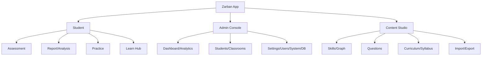

**User-role diagram**
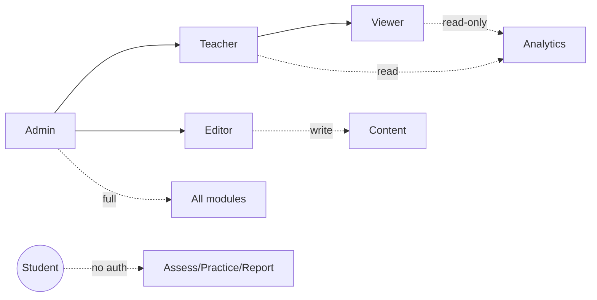

**Session state-transition**
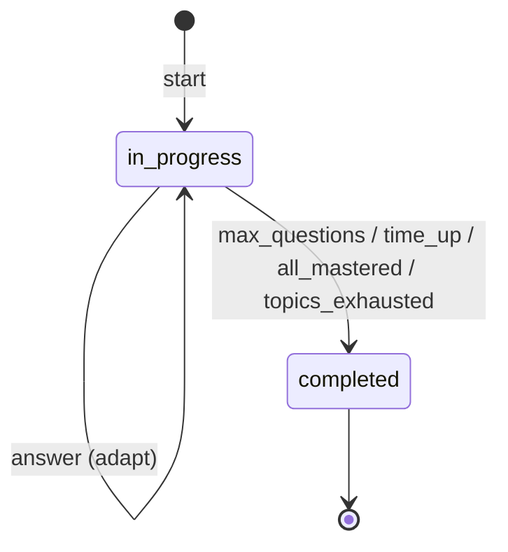

**Error-handling workflow**
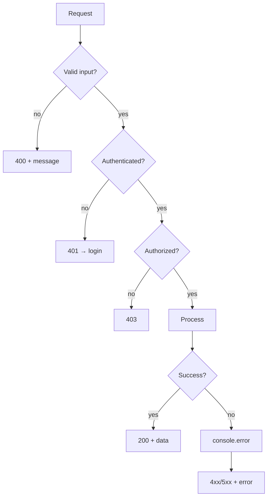

**Reporting workflow**
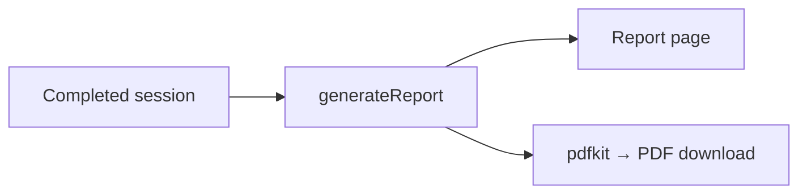

**File-upload (Excel) workflow**
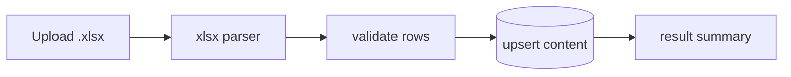

Each diagram's plain-language meaning is given in its section; the ones here read directly.

---

## 41. Requirements Traceability Matrix

| Req ID | Requirement | Module (page) | API | DB tables | Test |
|---|---|---|---|---|---|
| FR-001 | Start assessment | `/assessment` | `POST session/start` | students, sessions, questions | TC-01/02 |
| FR-002 | Submit & adapt | `/assessment` | `POST session/respond` | sessions, responses, bkt_state, traversal_events | (e2e lifecycle) |
| FR-004 | View report | `/report/[id]` | `GET session/report/[id]` | sessions, responses, dimension_scores | TC-10 |
| FR-005 | Report PDF | `/report/[id]` | `GET …/pdf` | (same) | (e2e) |
| FR-006 | Practice | `/practice` | `GET practice` | questions, skills, answer_traps | (manual) |
| FR-007 | Login | `/admin/login` | `POST admin/auth/login` | admin_users | TC-04/05 |
| FR-008 | RBAC | (all admin) | (all guarded) | admin_users | TC-06 |
| FR-009 | Dashboard | `/admin` | `GET admin/stats` | sessions, responses, skills | (e2e) |
| FR-010 | Analytics | `/admin/analytics` | `GET admin/analytics` | responses, traversal_events | (e2e) |
| FR-011 | Students | `/admin/students` | `GET/PATCH admin/students` | students, classrooms | (e2e) |
| FR-012 | Classrooms | `/admin/classrooms` | `admin/classrooms*` | classrooms, students | TC (RBAC) |
| FR-013 | Question bank | `/admin/questions` | `admin/questions*`, `admin/import` | questions, answer_traps | (e2e) |
| FR-014 | Skills & graph | `/content/skills` | `content/skills*` | skills, knowledge_graph | (e2e) |
| FR-015 | Curriculum | `/content/curriculum` | `content/curriculum*` | subjects, topics, textbooks | TC-09 |
| FR-016 | Excel I/O | `/content/import` | `content/import`, `content/export` | (content tables) | (manual) |
| FR-017 | Settings | `/admin/settings` | `GET/PUT admin/settings` | settings | TC-07 |
| FR-018 | Maintenance | `/admin/system` | `admin/maintenance` | sessions, responses, bkt_state, students | (manual) |
| FR-019 | Audit | `/admin/system` | `GET admin/audit` | admin_audit_log | (e2e) |
| FR-020 | DB manager | `/admin/database` | `admin/db*` | (all) | TC-08 |
| FR-021 | Session replay | `/admin/sessions/[id]` | `GET …/replay` | sessions, responses | (manual) |

---

## 42. Final Project Evaluation

| Dimension | Assessment |
|---|---|
| **Overall completion** | High — all core surfaces implemented and deployed live. |
| **Functional completeness** | High for the assessment/console/content scope; student accounts, payments, i18n are intentionally out of scope. |
| **Technical quality** | Strong — typed, modular, deterministic engine; clean layering. |
| **Code-structure quality** | Strong — clear `app`/`lib`/`scripts` separation; 46 focused route handlers. |
| **Database quality** | Strong — normalized, indexed, cascade-consistent 20-table schema. |
| **Security quality** | Good, with gaps — RBAC/bcrypt/JWT/audit/parameterized SQL present; missing rate-limiting, lockout, reset, backups. |
| **Testing quality** | Good — 136 e2e checks + type gate + content QA; load/security/browser testing not evidenced. |
| **Documentation quality** | Strong — README, technical handover, client brief, interactive guide, this document. |
| **Deployment readiness** | High — repeatable, documented, live. |
| **Production readiness** | **Conditional.** The application is deployed and functional, but true production hardening requires: automated backups, auth rate-limiting/lockout, forced rotation of demo credentials, and monitoring/alerting. **It should not be called fully production-ready until those are in place.** |

**Main risks:** no backups; open auth (no throttling/lockout); shipped demo credentials; no monitoring. **Recommended next steps (in order):** (1) backups, (2) auth hardening + credential rotation, (3) monitoring/alerts, (4) CI/CD with `tsc`+`e2e`, (5) persist IRT params for O(1) θ updates.

---

*Prepared from the supplied Zarban project files. Companion materials: `docs/TECHNICAL-HANDOVER.md` (deep-dive), `docs/Zarban-Client-Brief.pdf` (non-technical), `docs/guide.html` (interactive tour), `docs/VIDEO-SCRIPT.md` (screencast script).*
